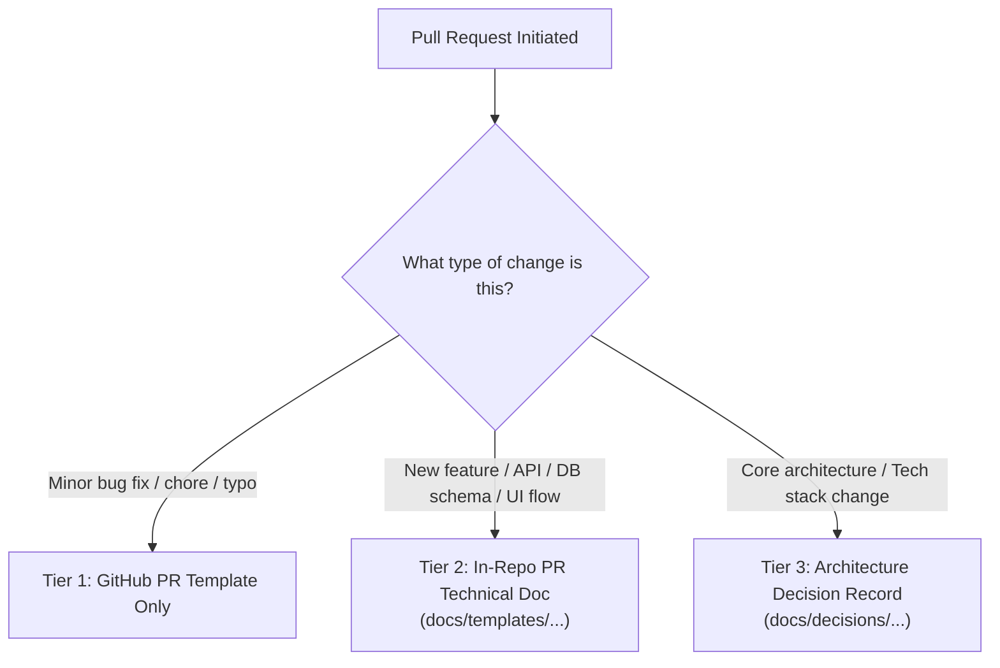
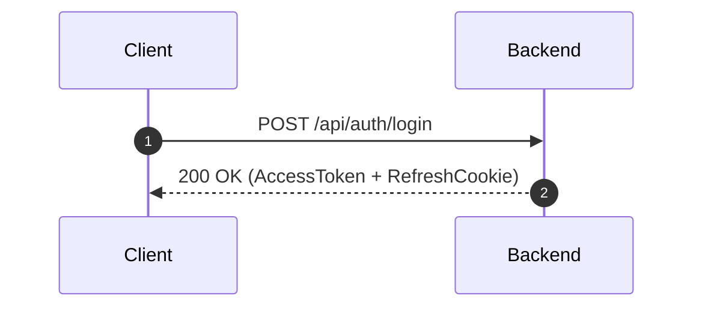
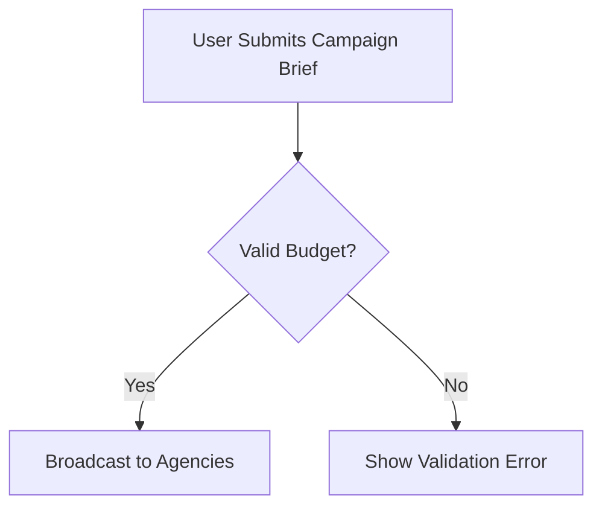

# Developer Documentation Guidelines & Standards

> **Applies to:** All developers, contributors, and technical reviewers working on **The AdBasket**.  
> **Core Principle:** **Docs-as-Code.** Documentation lives with the codebase and evolves atomically in every pull request.

---

## 1. The Documentation Framework

To avoid documentation decay and dead files, documentation in this repository is divided into three tiers:



| Tier | When to Use | Deliverable Location | Template |
| :--- | :--- | :--- | :--- |
| **Tier 1: PR Summary** | Bug fixes, typos, internal refactoring without contract changes | GitHub PR description | `.github/pull_request_template.md` |
| **Tier 2: Technical Spec / PR Doc** | New features, public APIs, database schema changes, new screens or major user journeys | `docs/features/<feature-name>.md` or `docs/backend/` / `docs/frontend/` | `docs/templates/backend-pr-document-template.md`<br/>`docs/templates/frontend-pr-document-template.md` |
| **Tier 3: Architecture Decision (ADR)** | Technology adoption, protocol changes, security/auth model changes, major structural shifts | `docs/decisions/NNNN-<title>.md` | `docs/templates/adr-template.md` |

---

## 2. When Must a Developer Write or Update Documentation?

A pull request **must include documentation changes** if it satisfies any of the following triggers:

### Backend Triggers
- **New or Modified Endpoints:** Any change to HTTP method, path, request/response body, headers, or query parameters.
- **Database Schema Alterations:** Adding tables, altering columns, creating indexes, or adding Flyway migration scripts (`V<version>__*.sql`).
- **Security & Authorization Rules:** Modifying roles, CORS policies, JWT validation rules, or `@PreAuthorize` scopes.
- **Background Jobs or Integrations:** Adding scheduled tasks, external third-party API clients (Google OAuth, Payment gateways).

### Frontend Triggers
- **New Pages or Routes:** Introducing a new route or navigation entry.
- **Component Architecture / State Changes:** Introducing shared contexts, state management stores, or major hooks.
- **API Contract Consumptions:** Hooking up new backend endpoints or altering API response handling.
- **Form Submissions & Validation:** Adding or modifying complex multi-step wizards or validation logic.

### Architectural Triggers
- Changing libraries, database engines, deployment topologies, or inter-service protocols.

---

## 3. Directory Layout & Standards

All documentation must reside inside the [`docs/`](file:///Users/amjangde/Workspace/advertisement/docs) directory:

```text
docs/
├── architecture/               # System-level, cross-cutting architectures & full reports
│   ├── backend_architecture_report.md
│   └── frontend_architecture_report.md
├── decisions/                  # Architecture Decision Records (ADRs) numbered sequentially
│   ├── 0001-record-architecture-decisions.md
│   └── 0002-<decision-title>.md
├── features/                   # Functional specs and feature documentation
├── backend/                    # Backend living documentation (APIs, schemas, services)
├── frontend/                   # Frontend living documentation (components, design system)
├── templates/                  # Standard templates for PRs and ADRs
│   ├── adr-template.md
│   ├── backend-pr-document-template.md
│   └── frontend-pr-document-template.md
├── GUIDELINES.md               # This guideline file
└── README.md                   # Directory table of contents and documentation index
```

### File Naming Conventions
- Always use `lowercase-kebab-case.md` (e.g., `campaign-tender-flow.md`, `billing-integration.md`).
- For ADRs, use four-digit zero-padded numbers: `0002-jwt-revocation-strategy.md`.

---

## 4. Diagramming Standards: Mermaid.js Only

**Do not upload unversioned binary diagrams (e.g. Draw.io PNGs, Visio files) as primary artifacts.**  
All diagrams must be written using **Mermaid.js** embedded directly inside Markdown code fences.

### Sequence Diagram Example
````markdown

````

### Flowchart Example
````markdown

````

**Benefits:**
- Can be code-reviewed directly in GitHub pull requests.
- Never goes out of date when someone changes a label or flow.
- GitHub natively renders Mermaid blocks in Markdown files and PR descriptions.

---

## 5. Standard Developer Workflow per Pull Request

1. **Check Out Branch from Master:**
   ```bash
   git checkout master
   git pull origin master
   git checkout -b feat/your-feature-name
   ```

2. **Determine Documentation Requirement:**
   - If introducing an architectural shift, draft an ADR in `docs/decisions/` using `docs/templates/adr-template.md`.
   - If introducing a backend feature/API, copy `docs/templates/backend-pr-document-template.md` into `docs/backend/` or `docs/features/`.
   - If introducing a frontend flow/screen, copy `docs/templates/frontend-pr-document-template.md` into `docs/frontend/` or `docs/features/`.
   - If updating existing behavior, update the relevant file in `docs/architecture/` or `docs/`.

3. **Commit Code and Documentation Together:**
   ```bash
   git add backend/ docs/
   git commit -m "feat(auth): implement refresh token rotation and document contract"
   ```

4. **Submit PR with the PR Template:**
   - Fill out the pre-populated checklist from `.github/pull_request_template.md`.
   - Provide visual proof (screenshots/GIFs) for frontend, or curl commands for backend.
   - Link the relevant document in `docs/`.

---

## 6. Reviewer Checklist (PR Blocking Rules)

Reviewers are required to **request changes** if:
- [ ] A new REST endpoint is created or altered without documentation.
- [ ] A Flyway migration is added without documenting the schema impact and rollback plan.
- [ ] A frontend page is added or redesigned without responsive UI screenshots or state handling notes.
- [ ] A major technology or design choice was made without an ADR in `docs/decisions/`.
- [ ] Diagrams were submitted as static images without editable Mermaid source code.
