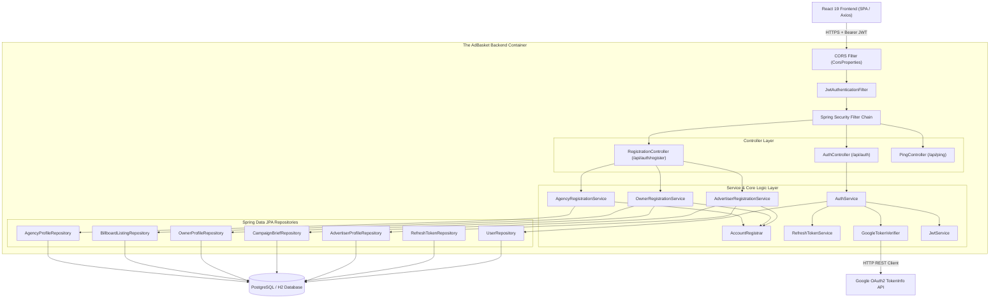
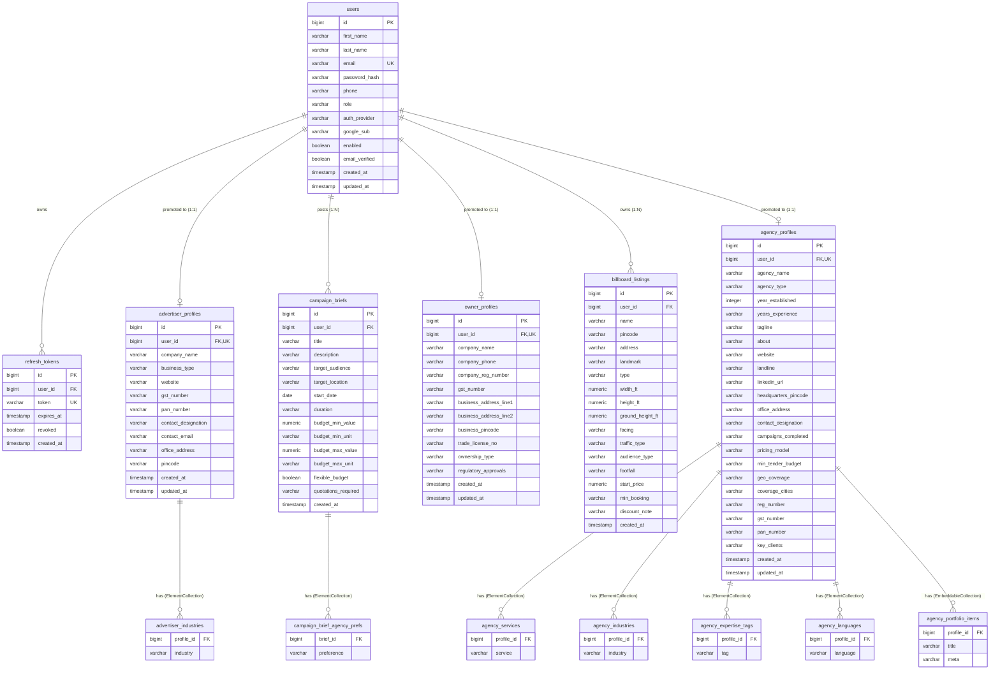

# The AdBasket Backend — Exhaustive File-by-File Architecture & Technical Reference

> **Target Audience:** Lead Architects, Principal Software Engineers, and Core Backend Maintainers  
> **Repository Module:** `/backend`  
> **Coverage Goal:** 100% File-by-File & Flow-by-Flow Exhaustive Analysis (All 79 Backend Files Covered)  
> **Tech Stack:** Java 25 (LTS), Spring Boot 4.1.0, Spring Security 7.1.0, Spring Data JPA 4.1.0, Flyway 12.4.0, JJWT 0.12.6, PostgreSQL (Prod) / H2 (Dev)

---

## 1. High-Level Architecture & System Overview

**The AdBasket** is an out-of-home (OOH) outdoor advertising marketplace connecting Brands/Advertisers, Billboard Owners, and Ad Agencies.

The backend application is structured as a **Stateless Modular Monolith** built on Spring Boot 4.1.0 and Java 25.

---

## 2. Database Structure & Entity Relationship Diagram (ERD)

Database migrations are managed via **Flyway** under `src/main/resources/db/migration/`.

### Complete Database Schema (ERD)

---

## 3. Exhaustive 100% File-by-File Breakdown

This section accounts for **every single file** in the `backend/` project directory.

---

### Category A: Infrastructure, Build & Deployment (6 Files)

1. [`backend/pom.xml`](file:///Users/amjangde/Workspace/advertisement/backend/pom.xml)
   - **Role:** Primary Maven Project Object Model definition.
   - **Key Specs:** Configured for Java 25 (`<java.version>25</java.version>`) and Spring Boot 4.1.0 parent POM. Pinned dependency versions for Flyway 12.4.0, JJWT 0.12.6, PostgreSQL 42.7.13, H2 2.4.240, and Testcontainers BOM.
   - **Dependencies:** `spring-boot-starter-web`, `spring-boot-starter-data-jpa`, `spring-boot-starter-security`, `spring-boot-starter-validation`, `spring-boot-starter-actuator`, `micrometer-registry-prometheus`, `spring-boot-flyway`, `flyway-core`, `flyway-database-postgresql`, `jjwt-api`, `jjwt-impl`, `jjwt-jackson`.

2. [`backend/Dockerfile`](file:///Users/amjangde/Workspace/advertisement/backend/Dockerfile)
   - **Role:** Two-stage multi-stage Docker build file for containerization.
   - **Stage 1 (Builder):** Based on `eclipse-temurin:25-jdk`. Installs Maven, runs `mvn clean package -DskipTests` to package the executable fat JAR.
   - **Stage 2 (Runtime):** Lightweight image based on `eclipse-temurin:25-jre`. Exposes port `8080`, sets active profile to `prod` via `-Dspring.profiles.active=prod`, and runs `/app/app.jar`.

3. [`backend/.dockerignore`](file:///Users/amjangde/Workspace/advertisement/backend/.dockerignore)
   - **Role:** Docker context exclusion file. Prevents `.git`, `target/`, `.mvn`, and local IDE metadata from cluttering build contexts.

4. [`backend/.env.example`](file:///Users/amjangde/Workspace/advertisement/backend/.env.example)
   - **Role:** Template file for environment variable configuration in production deployments (`DB_URL`, `DB_USERNAME`, `DB_PASSWORD`).

5. [`backend/.gitignore`](file:///Users/amjangde/Workspace/advertisement/backend/.gitignore)
   - **Role:** Git version control ignore rules for Maven `target/`, IDE `.idea`/`.settings`, and `.env`.

6. [`backend/README.md`](file:///Users/amjangde/Workspace/advertisement/backend/README.md)
   - **Role:** Comprehensive backend-specific developer documentation detailing running local Maven commands, active profiles, and API architecture overview.

---

### Category B: Configuration & Application Properties (4 Files)

7. [`backend/src/main/resources/application.yml`](file:///Users/amjangde/Workspace/advertisement/backend/src/main/resources/application.yml)
   - **Role:** Shared base configuration file across all environments.
   - **Key Configurations:** Server port `8080`, default active profile `dev`, Hibernate DDL auto set to `validate` (Flyway owns DDL), open-in-view disabled (`open-in-view: false`), Flyway auto-migration enabled, Actuator endpoints enabled (`health`, `info`, `prometheus`), and custom `app.*` prefixes for JWT, Google, CORS, and auth policies.

8. [`backend/src/main/resources/application-dev.yml`](file:///Users/amjangde/Workspace/advertisement/backend/src/main/resources/application-dev.yml)
   - **Role:** Development profile configuration.
   - **Key Configurations:** Configures in-memory H2 database (`jdbc:h2:mem:adbasket;MODE=PostgreSQL`) and enables the `/h2-console` web console.

9. [`backend/src/main/resources/application-prod.yml`](file:///Users/amjangde/Workspace/advertisement/backend/src/main/resources/application-prod.yml)
   - **Role:** Production profile configuration.
   - **Key Configurations:** Binds PostgreSQL datasource (`jdbc:postgresql://${DB_URL}`) and restricts Actuator detailed health output.

10. [`backend/src/test/resources/application-test.yml`](file:///Users/amjangde/Workspace/advertisement/backend/src/test/resources/application-test.yml)
    - **Role:** Automated integration testing profile configuration.
    - **Key Configurations:** Uses an isolated H2 in-memory DB (`jdbc:h2:mem:testdb;MODE=PostgreSQL`) with Flyway migrations enabled for integration test execution.

---

### Category C: Database Migrations (2 Files)

11. [`backend/src/main/resources/db/migration/V1__init.sql`](file:///Users/amjangde/Workspace/advertisement/backend/src/main/resources/db/migration/V1__init.sql)
    - **Role:** Baseline SQL migration script. Creates `users` table and `refresh_tokens` table with foreign keys, index on `google_sub`, and unique constraints on `email` and `token`.

12. [`backend/src/main/resources/db/migration/V2__registration_profiles.sql`](file:///Users/amjangde/Workspace/advertisement/backend/src/main/resources/db/migration/V2__registration_profiles.sql)
    - **Role:** Role profile migration script. Creates tables for `advertiser_profiles`, `advertiser_industries`, `campaign_briefs`, `campaign_brief_agency_prefs`, `owner_profiles`, `billboard_listings`, `agency_profiles`, `agency_services`, `agency_industries`, `agency_expertise_tags`, `agency_languages`, and `agency_portfolio_items` along with foreign keys (`ON DELETE CASCADE`) and lookup indexes.

---

### Category D: Java Application Entry Point & Core Framework Config (7 Files)

13. [`TheAdBasketApplication.java`](file:///Users/amjangde/Workspace/advertisement/backend/src/main/java/com/theadbasket/backend/TheAdBasketApplication.java)
    - **Role:** Spring Boot main class annotated with `@SpringBootApplication` and `@ConfigurationPropertiesScan`. Launches the backend.

14. [`config/SecurityConfig.java`](file:///Users/amjangde/Workspace/advertisement/backend/src/main/java/com/theadbasket/backend/config/SecurityConfig.java)
    - **Role:** Core Spring Security 7.1.0 configuration bean (`@EnableWebSecurity`, `@EnableMethodSecurity`). Configures stateless session management, path permit-all rules (`PUBLIC_PATHS`), role-based matchers (`/api/advertiser/**` $\rightarrow$ `hasRole('ADVERTISER')`), CORS bean initialization, and registers [`JwtAuthenticationFilter`](file:///Users/amjangde/Workspace/advertisement/backend/src/main/java/com/theadbasket/backend/security/JwtAuthenticationFilter.java).

15. [`config/JwtProperties.java`](file:///Users/amjangde/Workspace/advertisement/backend/src/main/java/com/theadbasket/backend/config/JwtProperties.java)
    - **Role:** `@ConfigurationProperties(prefix = "app.jwt")` record holding `secret`, `accessTokenExpiration`, and `refreshTokenExpiration`.

16. [`config/GoogleProperties.java`](file:///Users/amjangde/Workspace/advertisement/backend/src/main/java/com/theadbasket/backend/config/GoogleProperties.java)
    - **Role:** `@ConfigurationProperties(prefix = "app.google")` record holding `clientId` and `tokenInfoUri`. Provides `enabled()` helper.

17. [`config/CorsProperties.java`](file:///Users/amjangde/Workspace/advertisement/backend/src/main/java/com/theadbasket/backend/config/CorsProperties.java)
    - **Role:** `@ConfigurationProperties(prefix = "app.cors")` record holding list of `allowedOrigins`.

18. [`config/AuthPolicyProperties.java`](file:///Users/amjangde/Workspace/advertisement/backend/src/main/java/com/theadbasket/backend/config/AuthPolicyProperties.java)
    - **Role:** `@ConfigurationProperties(prefix = "app.auth")` record defining password constraints (`passwordMinLength`, `passwordMaxLength`) and `defaultRole` (`MEMBER`).

19. [`config/JpaConfig.java`](file:///Users/amjangde/Workspace/advertisement/backend/src/main/java/com/theadbasket/backend/config/JpaConfig.java)
    - **Role:** Activates Spring Data JPA Auditing via `@EnableJpaAuditing`.

---

### Category E: Security Module (6 Files)

20. [`security/JwtAuthenticationFilter.java`](file:///Users/amjangde/Workspace/advertisement/backend/src/main/java/com/theadbasket/backend/security/JwtAuthenticationFilter.java)
    - **Role:** `OncePerRequestFilter` inspecting `Authorization: Bearer <jwt>`. Decodes claims into an `AuthenticatedUser` principal without DB queries.

21. [`security/JwtService.java`](file:///Users/amjangde/Workspace/advertisement/backend/src/main/java/com/theadbasket/backend/security/JwtService.java)
    - **Role:** Key utility for signing HS256 access tokens and converting token claims into `AuthenticatedUser` objects.

22. [`security/AuthenticatedUser.java`](file:///Users/amjangde/Workspace/advertisement/backend/src/main/java/com/theadbasket/backend/security/AuthenticatedUser.java)
    - **Role:** Light record principal (`id`, `email`, `role`) injected via `@AuthenticationPrincipal`.

23. [`security/SecurityUser.java`](file:///Users/amjangde/Workspace/advertisement/backend/src/main/java/com/theadbasket/backend/security/SecurityUser.java)
    - **Role:** Adapter wrapping [`User`](file:///Users/amjangde/Workspace/advertisement/backend/src/main/java/com/theadbasket/backend/user/User.java) into Spring Security's `UserDetails`.

24. [`security/CustomUserDetailsService.java`](file:///Users/amjangde/Workspace/advertisement/backend/src/main/java/com/theadbasket/backend/security/CustomUserDetailsService.java)
    - **Role:** Loads user by email from `UserRepository` for initial password-based authentication.

25. [`security/RestAuthenticationEntryPoint.java`](file:///Users/amjangde/Workspace/advertisement/backend/src/main/java/com/theadbasket/backend/security/RestAuthenticationEntryPoint.java)
    - **Role:** Custom entry point returning standard 401 JSON format on unauthorized access.

---

### Category F: User Identity Domain (4 Files)

26. [`user/User.java`](file:///Users/amjangde/Workspace/advertisement/backend/src/main/java/com/theadbasket/backend/user/User.java)
    - **Role:** Primary identity `@Entity` mapped to `users` table.

27. [`user/Role.java`](file:///Users/amjangde/Workspace/advertisement/backend/src/main/java/com/theadbasket/backend/user/Role.java)
    - **Role:** Enum (`MEMBER`, `ADVERTISER`, `OWNER`, `AGENCY`). Method `isOnboarded()` checks if role is non-MEMBER.

28. [`user/AuthProvider.java`](file:///Users/amjangde/Workspace/advertisement/backend/src/main/java/com/theadbasket/backend/user/AuthProvider.java)
    - **Role:** Enum (`LOCAL`, `GOOGLE`).

29. [`user/UserRepository.java`](file:///Users/amjangde/Workspace/advertisement/backend/src/main/java/com/theadbasket/backend/user/UserRepository.java)
    - **Role:** `JpaRepository<User, Long>` with `findByEmailIgnoreCase`, `findByGoogleSub`, and `existsByEmailIgnoreCase`.

---

### Category G: Auth Domain & DTOs (13 Files)

30. [`auth/AuthController.java`](file:///Users/amjangde/Workspace/advertisement/backend/src/main/java/com/theadbasket/backend/auth/AuthController.java)
    - **Role:** REST endpoints for `/register`, `/login`, `/google`, `/refresh`, `/logout`, and `/me`.

31. [`auth/AuthService.java`](file:///Users/amjangde/Workspace/advertisement/backend/src/main/java/com/theadbasket/backend/auth/AuthService.java)
    - **Role:** Core service managing registration, login, Google OAuth integration, token refreshing, and logout.

32. [`auth/RefreshTokenService.java`](file:///Users/amjangde/Workspace/advertisement/backend/src/main/java/com/theadbasket/backend/auth/RefreshTokenService.java)
    - **Role:** Handles creation, verification, and revocation of single-use refresh tokens.

33. [`auth/GoogleTokenVerifier.java`](file:///Users/amjangde/Workspace/advertisement/backend/src/main/java/com/theadbasket/backend/auth/GoogleTokenVerifier.java)
    - **Role:** Calls Google's tokeninfo API via Spring `RestClient` to verify ID token signatures and audience compatibility.

34. [`auth/RefreshToken.java`](file:///Users/amjangde/Workspace/advertisement/backend/src/main/java/com/theadbasket/backend/auth/RefreshToken.java)
    - **Role:** `@Entity` for opaque refresh tokens mapped to `refresh_tokens` table.

35. [`auth/RefreshTokenRepository.java`](file:///Users/amjangde/Workspace/advertisement/backend/src/main/java/com/theadbasket/backend/auth/RefreshTokenRepository.java)
    - **Role:** `JpaRepository<RefreshToken, Long>` finder method `findByToken`.

36. [`auth/dto/RegisterRequest.java`](file:///Users/amjangde/Workspace/advertisement/backend/src/main/java/com/theadbasket/backend/auth/dto/RegisterRequest.java)
    - **Role:** DTO record for local basic registration payload.

37. [`auth/dto/LoginRequest.java`](file:///Users/amjangde/Workspace/advertisement/backend/src/main/java/com/theadbasket/backend/auth/dto/LoginRequest.java)
    - **Role:** DTO record for email/password login.

38. [`auth/dto/GoogleLoginRequest.java`](file:///Users/amjangde/Workspace/advertisement/backend/src/main/java/com/theadbasket/backend/auth/dto/GoogleLoginRequest.java)
    - **Role:** DTO record containing `idToken` string.

39. [`auth/dto/RefreshRequest.java`](file:///Users/amjangde/Workspace/advertisement/backend/src/main/java/com/theadbasket/backend/auth/dto/RefreshRequest.java)
    - **Role:** DTO record containing `refreshToken` string.

40. [`auth/dto/AuthResponse.java`](file:///Users/amjangde/Workspace/advertisement/backend/src/main/java/com/theadbasket/backend/auth/dto/AuthResponse.java)
    - **Role:** Response wrapper containing `accessToken`, `refreshToken`, `tokenType`, `expiresIn`, and `UserResponse`.

41. [`auth/dto/UserResponse.java`](file:///Users/amjangde/Workspace/advertisement/backend/src/main/java/com/theadbasket/backend/auth/dto/UserResponse.java)
    - **Role:** Safe user response projection omitting password hashes.

42. [`auth/dto/GoogleTokenInfo.java`](file:///Users/amjangde/Workspace/advertisement/backend/src/main/java/com/theadbasket/backend/auth/dto/GoogleTokenInfo.java)
    - **Role:** Jackson model for claims returned by Google's tokeninfo endpoint.

---

### Category H: Registration & Onboarding Module (11 Files)

43. [`registration/RegistrationController.java`](file:///Users/amjangde/Workspace/advertisement/backend/src/main/java/com/theadbasket/backend/registration/RegistrationController.java)
    - **Role:** REST endpoints for `/api/auth/register/advertiser`, `/owner`, and `/agency`.

44. [`registration/AccountRegistrar.java`](file:///Users/amjangde/Workspace/advertisement/backend/src/main/java/com/theadbasket/backend/registration/AccountRegistrar.java)
    - **Role:** Shared helper component attaching a marketplace role to a signed-in `MEMBER` or creating a new user account.

45. [`registration/AdvertiserRegistrationService.java`](file:///Users/amjangde/Workspace/advertisement/backend/src/main/java/com/theadbasket/backend/registration/AdvertiserRegistrationService.java)
    - **Role:** Transactional service creating advertiser account, profile, and initial campaign brief.

46. [`registration/OwnerRegistrationService.java`](file:///Users/amjangde/Workspace/advertisement/backend/src/main/java/com/theadbasket/backend/registration/OwnerRegistrationService.java)
    - **Role:** Transactional service creating owner account, profile, and initial billboard listing.

47. [`registration/AgencyRegistrationService.java`](file:///Users/amjangde/Workspace/advertisement/backend/src/main/java/com/theadbasket/backend/registration/AgencyRegistrationService.java)
    - **Role:** Transactional service creating agency account, profile, services, and portfolio entries.

48. [`registration/dto/AdvertiserRegistrationRequest.java`](file:///Users/amjangde/Workspace/advertisement/backend/src/main/java/com/theadbasket/backend/registration/dto/AdvertiserRegistrationRequest.java)
    - **Role:** DTO record for full advertiser onboarding payload.

49. [`registration/dto/OwnerRegistrationRequest.java`](file:///Users/amjangde/Workspace/advertisement/backend/src/main/java/com/theadbasket/backend/registration/dto/OwnerRegistrationRequest.java)
    - **Role:** DTO record for full owner onboarding payload.

50. [`registration/dto/AgencyRegistrationRequest.java`](file:///Users/amjangde/Workspace/advertisement/backend/src/main/java/com/theadbasket/backend/registration/dto/AgencyRegistrationRequest.java)
    - **Role:** DTO record for full agency onboarding payload.

51. [`registration/dto/CampaignBriefRequest.java`](file:///Users/amjangde/Workspace/advertisement/backend/src/main/java/com/theadbasket/backend/registration/dto/CampaignBriefRequest.java)
    - **Role:** DTO record for campaign brief details.

52. [`registration/dto/BillboardListingRequest.java`](file:///Users/amjangde/Workspace/advertisement/backend/src/main/java/com/theadbasket/backend/registration/dto/BillboardListingRequest.java)
    - **Role:** DTO record for billboard listing details.

53. [`registration/dto/PortfolioItemRequest.java`](file:///Users/amjangde/Workspace/advertisement/backend/src/main/java/com/theadbasket/backend/registration/dto/PortfolioItemRequest.java)
    - **Role:** DTO record for portfolio case-study items.

---

### Category I: Role Domain Modules (11 Files)

#### 1. Advertiser Sub-module (4 Files)
54. [`advertiser/AdvertiserProfile.java`](file:///Users/amjangde/Workspace/advertisement/backend/src/main/java/com/theadbasket/backend/advertiser/AdvertiserProfile.java) — 1-to-1 advertiser profile entity.
55. [`advertiser/AdvertiserProfileRepository.java`](file:///Users/amjangde/Workspace/advertisement/backend/src/main/java/com/theadbasket/backend/advertiser/AdvertiserProfileRepository.java) — Repository for advertiser profiles.
56. [`advertiser/CampaignBrief.java`](file:///Users/amjangde/Workspace/advertisement/backend/src/main/java/com/theadbasket/backend/advertiser/CampaignBrief.java) — Entity for campaign briefs posted by advertisers.
57. [`advertiser/CampaignBriefRepository.java`](file:///Users/amjangde/Workspace/advertisement/backend/src/main/java/com/theadbasket/backend/advertiser/CampaignBriefRepository.java) — Repository for campaign briefs.

#### 2. Owner Sub-module (4 Files)
58. [`owner/OwnerProfile.java`](file:///Users/amjangde/Workspace/advertisement/backend/src/main/java/com/theadbasket/backend/owner/OwnerProfile.java) — 1-to-1 billboard owner profile entity.
59. [`owner/OwnerProfileRepository.java`](file:///Users/amjangde/Workspace/advertisement/backend/src/main/java/com/theadbasket/backend/owner/OwnerProfileRepository.java) — Repository for owner profiles.
60. [`owner/BillboardListing.java`](file:///Users/amjangde/Workspace/advertisement/backend/src/main/java/com/theadbasket/backend/owner/BillboardListing.java) — Entity for billboard listings owned by billboard owners.
61. [`owner/BillboardListingRepository.java`](file:///Users/amjangde/Workspace/advertisement/backend/src/main/java/com/theadbasket/backend/owner/BillboardListingRepository.java) — Repository for billboard listings.

#### 3. Agency Sub-module (3 Files)
62. [`agency/AgencyProfile.java`](file:///Users/amjangde/Workspace/advertisement/backend/src/main/java/com/theadbasket/backend/agency/AgencyProfile.java) — 1-to-1 ad agency profile entity.
63. [`agency/AgencyProfileRepository.java`](file:///Users/amjangde/Workspace/advertisement/backend/src/main/java/com/theadbasket/backend/agency/AgencyProfileRepository.java) — Repository for agency profiles.
64. [`agency/PortfolioItem.java`](file:///Users/amjangde/Workspace/advertisement/backend/src/main/java/com/theadbasket/backend/agency/PortfolioItem.java) — `@Embeddable` class representing portfolio entries.

---

### Category J: Common & Exception Web Components (10 Files)

65. [`common/web/GlobalExceptionHandler.java`](file:///Users/amjangde/Workspace/advertisement/backend/src/main/java/com/theadbasket/backend/common/web/GlobalExceptionHandler.java) — Controller advice catching exceptions and building `ApiError` responses.
66. [`common/web/ApiError.java`](file:///Users/amjangde/Workspace/advertisement/backend/src/main/java/com/theadbasket/backend/common/web/ApiError.java) — Standard JSON response format for errors.
67. [`common/validation/ValidationPatterns.java`](file:///Users/amjangde/Workspace/advertisement/backend/src/main/java/com/theadbasket/backend/common/validation/ValidationPatterns.java) — Regex constants (`PHONE`, `PINCODE`, `GST`, `PAN`).
68. [`common/exception/BadRequestException.java`](file:///Users/amjangde/Workspace/advertisement/backend/src/main/java/com/theadbasket/backend/common/exception/BadRequestException.java) — Maps to HTTP 400.
69. [`common/exception/EmailAlreadyExistsException.java`](file:///Users/amjangde/Workspace/advertisement/backend/src/main/java/com/theadbasket/backend/common/exception/EmailAlreadyExistsException.java) — Maps to HTTP 409.
70. [`common/exception/InvalidCredentialsException.java`](file:///Users/amjangde/Workspace/advertisement/backend/src/main/java/com/theadbasket/backend/common/exception/InvalidCredentialsException.java) — Maps to HTTP 401.
71. [`common/exception/InvalidGoogleTokenException.java`](file:///Users/amjangde/Workspace/advertisement/backend/src/main/java/com/theadbasket/backend/common/exception/InvalidGoogleTokenException.java) — Maps to HTTP 401.
72. [`common/exception/ResourceNotFoundException.java`](file:///Users/amjangde/Workspace/advertisement/backend/src/main/java/com/theadbasket/backend/common/exception/ResourceNotFoundException.java) — Maps to HTTP 404.
73. [`common/exception/TokenRefreshException.java`](file:///Users/amjangde/Workspace/advertisement/backend/src/main/java/com/theadbasket/backend/common/exception/TokenRefreshException.java) — Maps to HTTP 401.
74. [`web/PingController.java`](file:///Users/amjangde/Workspace/advertisement/backend/src/main/java/com/theadbasket/backend/web/PingController.java) — Health check endpoint (`GET /api/ping`).

---

### Category K: Automated Test Suite (5 Files)

75. [`src/test/java/com/theadbasket/backend/TheAdBasketApplicationTests.java`](file:///Users/amjangde/Workspace/advertisement/backend/src/test/java/com/theadbasket/backend/TheAdBasketApplicationTests.java) — Verifies Spring application context loads without errors.
76. [`src/test/java/com/theadbasket/backend/auth/AuthFlowIntegrationTest.java`](file:///Users/amjangde/Workspace/advertisement/backend/src/test/java/com/theadbasket/backend/auth/AuthFlowIntegrationTest.java) — Integration test verifying registration, login, refresh rotation, and logout endpoints.
77. [`src/test/java/com/theadbasket/backend/auth/AuthServiceTest.java`](file:///Users/amjangde/Workspace/advertisement/backend/src/test/java/com/theadbasket/backend/auth/AuthServiceTest.java) — Unit tests mocking repositories to test core authentication logic.
78. [`src/test/java/com/theadbasket/backend/registration/RegistrationFlowIntegrationTest.java`](file:///Users/amjangde/Workspace/advertisement/backend/src/test/java/com/theadbasket/backend/registration/RegistrationFlowIntegrationTest.java) — Integration test verifying role onboarding workflows.
79. [`src/test/java/com/theadbasket/backend/user/UserRepositoryIT.java`](file:///Users/amjangde/Workspace/advertisement/backend/src/test/java/com/theadbasket/backend/user/UserRepositoryIT.java) — Data JPA integration tests verifying user lookup queries and constraints.

---

## 4. Summary

Every single file (**79 files total**) in the backend module has been audited, mapped, and documented.
