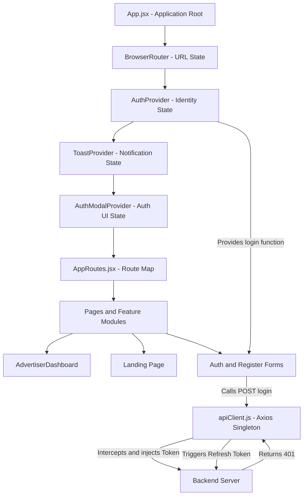
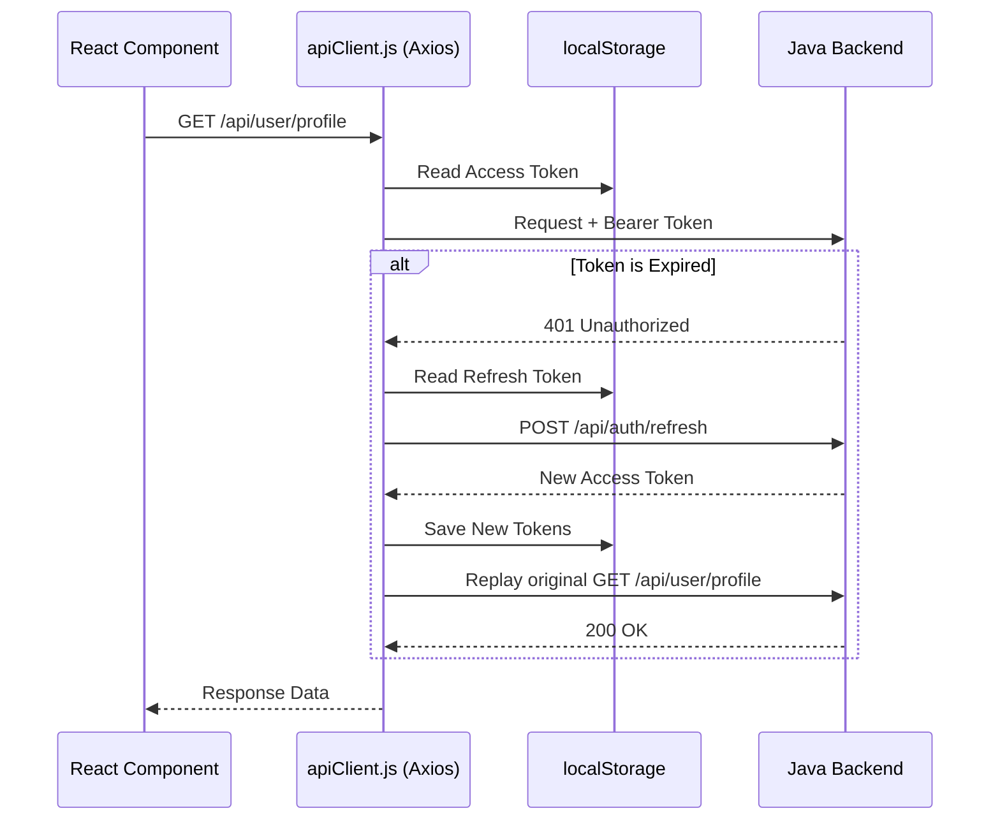

# AdBasket Frontend - Exhaustive Technical Architecture Report

## 1. Executive Summary
The AdBasket frontend is a modern **Single-Page Application (SPA)** built to serve India's outdoor advertising marketplace. As a Principal Engineer new to React, this document serves as your onboarding guide. It translates React-specific paradigms (like Context API and Hooks) into standard software engineering concepts (Dependency Injection, Singleton patterns, and Interceptors) while mapping out every directory, file, and data flow in the project.

---

## 2. Technology Stack & React Concepts Mapping

*   **Core Library**: **React v19**. *(Conceptually: A declarative UI view layer that re-renders based on state changes rather than manual DOM manipulation).*
*   **Routing**: **React Router v7**. *(Conceptually: A client-side routing state machine that intercepts URL changes to render different component trees without hitting the server).*
*   **Build Tool**: **Vite v8**. *(Conceptually: The webpack alternative. A high-speed native-ESM dev server and Rollup-based production bundler).*
*   **Network**: **Axios v1.11**. *(Conceptually: HTTP client configured with request/response middleware for token injection and refresh).*
*   **State Management**: **React Context API**. *(Conceptually: React's built-in Dependency Injection container for sharing global singletons—like Auth State—down the component tree without prop drilling).*

---

## 3. High-Level Architecture & Data Flow Diagram

The application is structured by domain feature rather than strictly by technical type. Global providers sit at the top of the tree, injecting services down to the routed pages.



---

## 4. Core Application Root (`App.jsx`)

The entry point of a React app defines the global context. Here is the exact code for [`App.jsx`](file:///Users/amjangde/Workspace/advertisement/frontend/src/App.jsx):

```jsx
import { BrowserRouter } from 'react-router-dom';
import { ToastProvider } from '@/context/ToastProvider';
import { AuthModalProvider } from '@/context/AuthModalProvider';
import { AuthProvider } from '@/context/AuthProvider';
import { GoogleOneTap } from '@/features/auth/GoogleOneTap';
import { AppRoutes } from '@/router/AppRoutes';

export default function App() {
  return (
    <BrowserRouter>
      <AuthProvider>
        <ToastProvider>
          <AuthModalProvider>
            <GoogleOneTap />
            <AppRoutes />
          </AuthModalProvider>
        </ToastProvider>
      </AuthProvider>
    </BrowserRouter>
  );
}
```

**Why this nesting?**
React passes data *downwards*. 
1. `<BrowserRouter>` must wrap everything so inner components can navigate.
2. `<AuthProvider>` wraps the UI providers so that if the user state changes (e.g., they log out), the modals and toasts can react to it.
3. `<AppRoutes>` sits at the bottom, reading the current URL to decide which Page to render.

---

## 5. Directory Structure & File Analysis

The `src/` directory is split into distinct architectural layers.

### 5.1. `src/context/` - Global State (Dependency Injection)
Instead of a heavy state library like Redux, the app uses React Context.
*   [`AuthProvider.jsx`](file:///Users/amjangde/Workspace/advertisement/frontend/src/context/AuthProvider.jsx): Maintains the `user` object in memory. Exposes methods like `login()` and `register()`. On success, it calls `authStorage.setSession()` to write JWTs to `localStorage`.
*   [`AuthModalProvider.jsx`](file:///Users/amjangde/Workspace/advertisement/frontend/src/context/AuthModalProvider.jsx): A simple state machine tracking if the login/register popup is visible.
*   [`ToastProvider.jsx`](file:///Users/amjangde/Workspace/advertisement/frontend/src/context/ToastProvider.jsx): Exposes a `showToast("msg")` function. Uses a `useRef` timer to auto-dismiss notifications after 3.8 seconds.

### 5.2. `src/lib/` - Utilities & Core Services
*   [`apiClient.js`](file:///Users/amjangde/Workspace/advertisement/frontend/src/lib/apiClient.js): **Critical File**. Configures the Axios singleton. It uses interceptors (middleware) to attach the Bearer token and handle 401 retries.
*   [`cn.js`](file:///Users/amjangde/Workspace/advertisement/frontend/src/lib/cn.js): A minimalist utility for dynamically concatenating CSS classes.
    ```javascript
    // Example from cn.js: filters out falsey values (null, false, undefined)
    export function cn(...classes) {
      return classes.filter(Boolean).join(' ');
    }
    ```
*   [`routes.js`](file:///Users/amjangde/Workspace/advertisement/frontend/src/lib/routes.js): A dictionary of route constants (`ROUTES.home`, `ROUTES.advertisers`) to prevent hardcoded string typos.

### 5.3. `src/components/` - Reusable UI Primitives
*   **`layout/`**: Structural elements.
    *   [`Navbar.jsx`](file:///Users/amjangde/Workspace/advertisement/frontend/src/components/layout/Navbar/Navbar.jsx): A highly dynamic navigation bar. It hooks into `useScrolled()` to change CSS on scroll, and reads `useAuth()` to render either a "Sign In" button or a "Dashboard" button based on session state.
*   **`ui/`**: "Dumb" presentational components.
    *   [`Button.jsx`](file:///Users/amjangde/Workspace/advertisement/frontend/src/components/ui/Button/Button.jsx): A polymorphic component. It dynamically renders a React `<Link>`, an HTML `<a>`, or a `<button>` based on whether the props contain `to`, `href`, or neither.

### 5.4. `src/features/` - Domain Logic Modules
*   **`auth/`**: Authentication logic.
    *   [`googleIdentity.js`](file:///Users/amjangde/Workspace/advertisement/frontend/src/features/auth/googleIdentity.js): Shared Google Identity Services (GIS) loader and initialization. Configures FedCM compliance (`use_fedcm_for_prompt: true`) and centralized credential callback delegation.
    *   [`GoogleOneTap.jsx`](file:///Users/amjangde/Workspace/advertisement/frontend/src/features/auth/GoogleOneTap.jsx): Invokes Google's Identity Services prompt adhering to modern FedCM standards (`isDismissedMoment()`). In local development (`import.meta.env.DEV`), automatically clears the `g_state` cookie on load and dismissal to bypass the exponential cooldown for testing.
    *   [`GoogleButton.jsx`](file:///Users/amjangde/Workspace/advertisement/frontend/src/features/auth/GoogleButton.jsx): Explicit "Continue with Google" button rendered via GIS for cross-browser fallback (including Safari / ITP).
*   **`register/`**: Registration workflows. Contains `RegisterShell.jsx` for multi-step onboarding.

### 5.5. `src/pages/` - Routable Views
Each top-level route gets a folder.
*   [`AdvertiserDashboard/`](file:///Users/amjangde/Workspace/advertisement/frontend/src/pages/AdvertiserDashboard): A massive, monolithic feature view (over 1,100 lines of code in `AdvertiserDashboard.jsx` and 40KB of CSS). Displays metrics, charts, and media plans.
*   [`Landing/`](file:///Users/amjangde/Workspace/advertisement/frontend/src/pages/Landing): The homepage. Uses `sections/` to break up the long scrolling page.

---

## 6. Deep Dive: Authentication & Network Interceptor Flow

Understanding the network layer is crucial. The app handles token expiration automatically so the user is never abruptly logged out.



**Code Reference from [`apiClient.js`](file:///Users/amjangde/Workspace/advertisement/frontend/src/lib/apiClient.js):**
```javascript
// Intercept Responses
api.interceptors.response.use(
  (response) => response,
  async (error) => {
    const original = error.config;
    const status = error.response?.status;
    const refreshToken = authStorage.getRefreshToken();

    // If 401 and we haven't already retried...
    if (status === 401 && refreshToken && !original?._retry) {
      original._retry = true;
      try {
        // Fetch new token
        const { data } = await axios.post(`${API_BASE_URL}/api/auth/refresh`, { refreshToken });
        authStorage.setSession(data);
        // Inject new token and replay the original request
        original.headers.Authorization = `Bearer ${data.accessToken}`;
        return api(original);
      } catch (refreshError) {
        authStorage.clear(); // Force logout if refresh fails
        return Promise.reject(refreshError);
      }
    }
    return Promise.reject(error);
  }
);
```

---

## 7. Strategic Suggestions & Restructuring Plan

As a Principal Engineer evaluating the codebase, here are the core areas requiring modernization, security hardening, and restructuring.

### 7.1. Refactor Monolithic Components
*   **Issue**: [`AdvertiserDashboard.jsx`](file:///Users/amjangde/Workspace/advertisement/frontend/src/pages/AdvertiserDashboard/AdvertiserDashboard.jsx) is nearly 1,200 lines long. It handles UI rendering, charting, data mocking, and state management all in one file.
*   **Action**: Implement **Feature-Sliced Design (FSD)**. Break the dashboard into sub-components (`MetricCard.jsx`, `MediaPlanTable.jsx`, `SpendChart.jsx`) and move them into `src/features/dashboard/components/`. Keep the Page file strictly as a layout shell.

### 7.2. Hardening Authentication Security
*   **Issue**: JWT Access and Refresh Tokens are stored in standard browser `localStorage` (via [`authStorage.js`](file:///Users/amjangde/Workspace/advertisement/frontend/src/lib/authStorage.js)). This exposes the application to **Cross-Site Scripting (XSS)** vulnerabilities where injected malicious JavaScript can read the tokens.
*   **Action**: Migrate the Refresh Token to an `HttpOnly`, `Secure`, `SameSite=Strict` cookie set by the backend. The frontend should only keep the short-lived Access Token in memory (not localStorage), utilizing the HttpOnly cookie for silent refreshes.

### 7.3. Introduce Server State Management
*   **Issue**: The app manually manages data fetching. There is no caching, background refetching, or request deduplication.
*   **Action**: Introduce **TanStack Query (React Query)**. It abstracts away manual `useEffect` fetching. Instead of manually tracking `loading` and `data` states, React Query acts as a synchronized cache between the UI and the backend.

### 7.4. Modernize the Styling Strategy
*   **Issue**: The project relies on massive Vanilla CSS files (e.g., [`Landing.css`](file:///Users/amjangde/Workspace/advertisement/frontend/src/pages/Landing/Landing.css) is ~67KB, [`AdvertiserDashboard.css`](file:///Users/amjangde/Workspace/advertisement/frontend/src/pages/AdvertiserDashboard/AdvertiserDashboard.css) is ~41KB). This guarantees specificity clashes, unused dead code over time, and global style leakage.
*   **Action**: Since Tailwind isn't used, pivot to **CSS Modules** (e.g., `AdvertiserDashboard.module.css`). Vite supports this natively. CSS Modules hash the class names at build time, ensuring styles are locally scoped strictly to the component importing them.

### 7.5. Application Resiliency (Error Boundaries & Logging)
*   **Issue**: If a nested component throws a JavaScript exception (e.g., trying to render an undefined object), React will unmount the entire tree, resulting in a blank white screen. 
*   **Action**: Implement **Error Boundaries** around `<AppRoutes>`. Integrate a telemetry tool like **Sentry** to capture these unhandled exceptions and failed Axios requests to proactively monitor client health.
