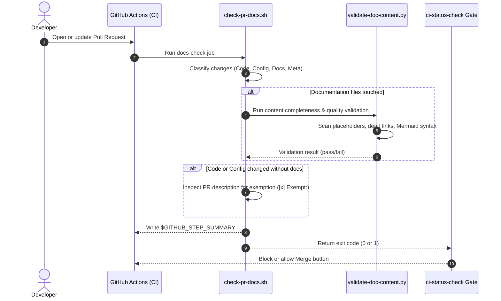

# Technical Specification: Automated PR Documentation Verification System

- **PR Link / Ticket:** PR # / CI Documentation System
- **Author:** @amjangde
- **Date:** 2026-09-07
- **Module / Path:** `.github/workflows/ci.yml`, `.github/scripts/`

---

## 1. Overview & Business Intent

As the codebase scales across frontend (React 19) and backend (Spring Boot 4), documentation must evolve atomically with implementation changes to prevent drift and obsolete wiki pages.

This feature establishes an automated, continuous integration gate that evaluates incoming pull requests against repository documentation standards before code can be merged into `master`.

---

## 2. Technical Architecture & Component Flow

The verification framework operates through a bash orchestrator and an advanced Python static analysis engine integrated directly into GitHub Actions.



---

## 3. Classification & Enforcement Rules

| PR Change Category | Detection Pattern | Enforcement Policy |
| :--- | :--- | :--- |
| **Application Code** | `backend/` or `frontend/` (non-markdown) | Requires accompanying documentation in `docs/` or `README.md`, or explicit exemption mark. |
| **Configuration & Infra** | `docker-compose*.yml`, `.env*`, `.github/workflows/`, `Dockerfile*`, `nginx.conf` | Requires accompanying documentation or explicit exemption mark. |
| **Database Migrations** | `backend/.../db/migration/V*.sql` | Specifically flagged to ensure schema documentation is updated. |
| **Pure Documentation** | `docs/**`, `*.md` | Automatically allowed; validated for syntax, broken links, and placeholder elimination. |
| **Repo Maintenance** | `.gitignore`, `.vscode/**` | Allowed without documentation requirement. |

---

## 4. Document Quality & Completeness Checks

Every markdown document touched in a PR is evaluated by `validate-doc-content.py` for:

1. **Boilerplate Placeholders:** Flags unedited template variables (e.g. unreplaced title fields, github handles, ticket numbers, HTTP methods, and unresolved task markers).
2. **Template Duplication:** Flags exact copies of files from `docs/templates/`.
3. **Dead Relative Links:** Resolves relative links against the repository filesystem to guarantee no broken references are introduced.
4. **Mermaid Block Integrity:** Verifies all Mermaid fences declare valid diagram types (`graph`, `sequenceDiagram`, `flowchart`, `classDiagram`, `erDiagram`, etc.) and are balanced.
5. **Code Fence Balance:** Ensures markdown code blocks are properly closed.
6. **Empty Section Detection:** Prohibits consecutive headers without body content.

---

## 5. CI & Merge Gate Integration

The job is integrated into `.github/workflows/ci.yml`:
- **Job Name:** `docs-check` ("PR Documentation Check")
- **Gate Dependency:** Included in `needs: [frontend-ci, backend-ci, docs-check]` within `ci-status-check` ("CI / All Checks Passed").
- **Merge Hook:** When GitHub branch protection requires `CI / All Checks Passed`, failing `docs-check` blocks the merge button.

---

## 6. Verification & Test Evidence

The script suite has been verified locally across multiple edge-case configurations.

### Local Test Results
```bash
$ GITHUB_EVENT_NAME=local GITHUB_BASE_REF=master GITHUB_STEP_SUMMARY=/tmp/summary.md .github/scripts/check-pr-docs.sh
========================================================
    The AdBasket — PR Documentation Compliance Check    
========================================================
Comparing HEAD against origin/master...
Changed files detected (Added/Modified):
.github/scripts/check-pr-docs.sh
.github/scripts/validate-doc-content.py
.github/workflows/ci.yml
README.md
docs/features/pr-documentation-verification-system.md
--------------------------------------------------------
⚙️  Configuration or infrastructure changes detected.
📄 Documentation files detected in PR:
README.md
docs/features/pr-documentation-verification-system.md

🔍 Validating documentation files for completeness, code fences, links, and placeholders...
🔍 Validating 1 documentation file(s) for completeness...
✅ All documentation files are properly filled, structured, and verified!
✅ Documentation files verified.

✅ Code/Configuration changes accompanied by verified documentation. Check passed!
```
