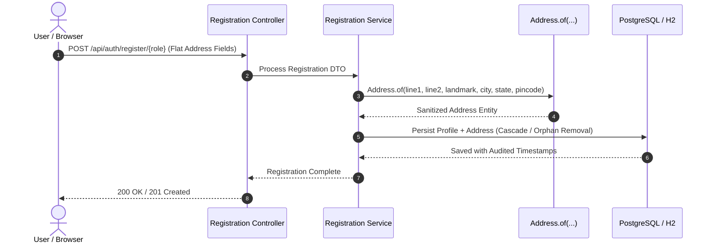

# PR-11: Database Schema Normalization & Address Refactoring

- **PR Link / Ticket:** [PR #11](https://github.com/Advertisement-Market/advertisement/pull/11)
- **Author:** @vedafactor
- **Date:** 2026-09-08
- **Module / Path:** `backend/`, `frontend/`, `docs/prs/`

---

## 1. Executive Summary

This pull request standardizes and normalizes the database schema by extracting embedded address attributes from `users`, `advertiser_profiles`, `agency_profiles`, and `billboard_listings` into a dedicated `addresses` table.

Along with the forward Flyway migration, this change:

* Aligns the domain model with Spring Data JPA auditing.
* Centralizes entity construction using a static factory method with input sanitization.
* Preserves the existing flat REST API registration contracts.
* Updates the HTML registration template.
* Updates React registration mappers.
* Adds automated test suites across both the frontend and backend.
* Hardens token deserialization for Google authentication responses.

---

## 2. Architecture & Data Flow

```mermaid
graph TD
    subgraph Client Layer
        React[React Registration Wizards]
        HTML[advertiser-register.html]
    end

    subgraph API Layer
        RegController[/api/auth/register/*]
        DTO[Registration Request DTOs - Flat Contract]
    end

    subgraph Domain & Persistence
        Factory[Address.of Factory Method]
        Auditing[Spring Data JPA Auditing - Instant]
        AddressEntity[(Address Entity)]
        AddressTable[(addresses Table)]
        ProfileTable[(Profile / Listing Tables)]
    end

    React -->|JSON Payload| RegController
    HTML -->|Form Payload| RegController
    RegController --> DTO
    DTO --> Factory
    Factory -->|Sanitized & Trimmed| AddressEntity
    AddressEntity --> AddressTable
    ProfileTable -->|FK: address_id| AddressTable
    Auditing -->|created_ts / updated_ts| AddressTable
```

---

## 3. Detailed Changes

### 3.1 Database Migration

A new Flyway migration, `V3__normalize_schema.sql`, was introduced to normalize address-related data.

#### Changes

* Created a normalized `addresses` table with the following attributes:

  * `id`
  * `address_line1`
  * `address_line2`
  * `landmark`
  * `city`
  * `state`
  * `pincode`
  * `created_ts`
  * `updated_ts`

* Added foreign key constraints using `address_id` to link:

  * `users`
  * `advertiser_profiles`
  * `agency_profiles`
  * `billboard_listings`

  to `addresses(id)`.

* Added performance indexes for the new foreign key relationships.

* Preserved historical migration script immutability for `V1` and `V2`.

---

### 3.2 Backend Implementation

#### JPA Auditing & Lifecycle — Item #4

Spring Data JPA auditing was introduced for the `Address` entity.

* Configured `@CreatedDate` for `created_ts`.
* Configured `@LastModifiedDate` for `updated_ts`.
* Both fields use `java.time.Instant`.
* Removed the previous custom `@PrePersist` and `@PreUpdate` lifecycle hooks.
* Timestamp management is now handled consistently by Spring Data JPA auditing.

---

#### Identity Safety — Item #5

ID management for the `Address` entity was encapsulated to prevent accidental mutation of surrogate keys.

* Removed the public `setId()` method from `Address`.
* The entity ID can now only be managed by the persistence layer.

This prevents application code from manually changing an existing address's database identity.

---

#### Centralized Factory Construction — Item #6

A static factory method was introduced:

```java
Address.of(line1, line2, landmark, city, state, pincode)
```

The factory centralizes address construction and ensures consistent input sanitization.

It is responsible for:

* Trimming leading and trailing whitespace.
* Converting blank strings to `null`.
* Creating a consistently initialized `Address` entity.

The factory is used across:

* `AccountRegistrar`
* `AdvertiserRegistrationService`
* `AgencyRegistrationService`
* `OwnerRegistrationService`

This avoids duplicated address-cleaning logic across registration services.

---

#### API Contract Stability & Dead Code Elimination — Item #7

The existing flat registration request structure was preserved to avoid breaking frontend API payloads.

The following request DTOs continue to expose flat address fields:

* `AdvertiserRegistrationRequest`
* `AgencyRegistrationRequest`
* `OwnerRegistrationRequest`

The legacy `AddressDto.java` class was also removed because it was no longer required.

This keeps the API contract stable while allowing the persistence model to use the normalized `Address` entity.

---

#### Token Deserialization Hardening

Google token deserialization was hardened to handle unexpected or additional claims.

Changes include:

* Added:

```java
@JsonIgnoreProperties(ignoreUnknown = true)
```

to `GoogleTokenInfo`.

* Added custom handling for string-encoded boolean values, such as:

```json
{
  "email_verified": "true"
}
```

This allows the token parser to correctly handle boolean claims represented as strings.

---

## 3.3 Frontend Updates

### HTML Registration Template — Items #10, #11 & #12

The legacy address textarea in `advertiser-register.html` was replaced with structured address fields.

#### Previous Field

```text
f_officeAddress
```

#### New Fields

```text
f_addressLine1
f_addressLine2
f_landmark
f_city
f_state
f_pincode
```

---

### Address Validation

The `validateStep(3)` validation logic was updated.

The following fields are mandatory:

* Address Line 1
* City
* State
* Pincode

The pincode must also satisfy a six-digit validation rule.

```regex
^\d{6}$
```

---

### Registration Review

`populateReview()` was updated to format the structured address fields and display them in:

```text
rv_address
```

The review section now presents the normalized address components in a readable format instead of displaying a single unstructured address string.

---

### PIN Code Autofill

`autofillCity()` was enhanced to automatically populate the city and state fields when a valid six-digit Indian PIN code is entered.

The autofill behavior is triggered after validating the pincode format.

---

### React Registration Mappers

`registrationMappers.js` was updated to construct flat address payloads that match the backend registration request specifications.

This ensures that the React registration flow remains compatible with the existing backend API contract.

---

## 4. Registration Flow

The following sequence describes the end-to-end registration process.



### Flow Summary

1. The client submits registration data using the existing flat address fields.
2. The registration controller receives the request.
3. The request DTO is passed to the appropriate registration service.
4. The service constructs the address using `Address.of(...)`.
5. The factory trims whitespace and converts blank values to `null`.
6. The address and associated profile/listing are persisted.
7. JPA auditing automatically populates the creation and modification timestamps.
8. The API returns a successful registration response.

---

## 5. Verification & Test Results

### 5.1 Backend Test Suite

**Command:**

```bash
mvn test
```

**Result:**

**43 / 43 tests passing**

#### Test Coverage

| Test Suite                        | Purpose                                                                                      |
| --------------------------------- | -------------------------------------------------------------------------------------------- |
| `AddressTest`                     | Validates static factory sanitization, whitespace trimming, and blank-to-null coercion.      |
| `AddressPersistenceTest`          | Validates JPA auditing timestamp population and cascade/orphan removal behavior.             |
| `AddressValidationTest`           | Validates Jakarta Bean Validation constraints on address fields.                             |
| `GoogleTokenInfoTest`             | Validates claim parsing, unknown-property resilience, and string-to-boolean deserialization. |
| `RegistrationFlowIntegrationTest` | Validates end-to-end multi-role registration persistence.                                    |

---

### 5.2 Frontend Test Suite

**Command:**

```bash
vitest run
```

**Result:**

**17 / 17 tests passing across 3 suites**

#### Test Coverage

| Test Suite                    | Purpose                                                                         |
| ----------------------------- | ------------------------------------------------------------------------------- |
| `pincodeAutofill.test.js`     | Validates postal code lookup and city/state auto-population.                    |
| `registrationMappers.test.js` | Validates conversion of form values into the expected API registration payload. |
| `validators.test.js`          | Validates input boundaries and regular-expression checks.                       |

---

### 5.3 Code Quality & Compliance

The following checks were completed successfully:

* Prettier formatting check passed.
* `npm run format:check` completed successfully.
* All compliance checks passed.
* All lint checks passed.

---

## 6. Summary

PR #11 introduces a normalized address model while maintaining compatibility with the existing registration API.

The primary architectural change is the extraction of address information into a dedicated `addresses` table, with profile and listing entities referencing addresses through foreign keys.

The implementation also improves maintainability by:

* Centralizing address creation and sanitization.
* Using Spring Data JPA auditing for timestamps.
* Protecting entity identity from manual mutation.
* Maintaining flat API registration contracts.
* Removing unused DTO code.
* Improving Google token deserialization resilience.
* Introducing structured address fields in the registration UI.
* Adding PIN-code-based city/state autofill.
* Providing comprehensive backend and frontend automated test coverage.

### Final Verification

| Area                       | Status            |
| -------------------------- | ----------------- |
| Database Migration         | ✅ Complete        |
| Backend Refactoring        | ✅ Complete        |
| Frontend Updates           | ✅ Complete        |
| API Contract Compatibility | ✅ Preserved       |
| Backend Tests              | ✅ 43 / 43 Passing |
| Frontend Tests             | ✅ 17 / 17 Passing |
| Formatting                 | ✅ Passing         |
| Lint & Compliance          | ✅ Passing         |
