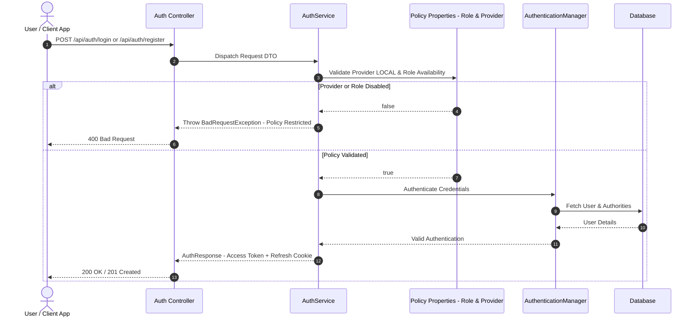

# PR Document: Configuration-Driven Hot-Reload & Security Policy Enforcement

* **PR Link / Ticket:** [PR #12](https://github.com/Advertisement-Market/advertisement/pull/12)
* **Author:** `@vedafactor`
* **Date:** 2026-09-08
* **Module / Path:** `backend/`, `config/`, `docs/prs/`

---

## 1. Executive Summary

This pull request implements dynamic, configuration-driven feature policy enforcement for role management and authentication providers across the backend service.

It introduces centralized policy models, `RolePolicyProperties` and `AuthProviderPolicyProperties`, and improves the security architecture by isolating Actuator authentication credentials from the application's global authentication system.

The changes also:

* Eliminate global `AuthenticationManager` collision issues.
* Isolate Actuator security credentials.
* Enforce strict guards against disabled roles.
* Enforce strict guards against disabled authentication providers.
* Prevent local authentication when the `LOCAL` provider is disabled.
* Prevent Google authentication when the `GOOGLE` provider is disabled.
* Resolve non-deterministic configuration behavior caused by duplicate policy files.
* Establish `backend/config/feature-policy.yml` as the canonical configuration source.
* Expand the automated backend test suite to **50 passing tests**.

---

## 2. Architecture & Data Flow

```mermaid
graph TD

    subgraph Configuration Layer
        YML[backend/config/feature-policy.yml]
        RoleProps[RolePolicyProperties]
        AuthProps[AuthProviderPolicyProperties]
    end

    subgraph Authentication & Registration
        RegController[/api/auth/register/*]
        LoginController[/api/auth/login]
        GoogleLogin[/api/auth/google]
        AuthService[AuthService]
    end

    subgraph Security Context & Validation
        ActuatorSec[ActuatorSecurityConfig]
        ActuatorMem[InMemoryUserDetailsManager - Actuator Admin Only]
        CustomUserDS[@Primary CustomUserDetailsService]
        GlobalAuthMgr[Global AuthenticationManager - DaoAuthenticationProvider]
        UserDB[(User Database)]
    end

    YML --> RoleProps
    YML --> AuthProps

    RoleProps --> AuthService
    AuthProps --> AuthService

    RegController --> AuthService
    LoginController --> AuthService
    GoogleLogin --> AuthService

    AuthService -->|Policy Checks: isEnabled| GlobalAuthMgr
    CustomUserDS --> GlobalAuthMgr
    GlobalAuthMgr --> UserDB

    ActuatorSec -->|Scoped strictly to Actuator Filter Chain| ActuatorMem
```

### Architecture Summary

The configuration file acts as the central source of truth for authentication providers and application roles.

The flow is:

```text
feature-policy.yml
        |
        +--------------------+
        |                    |
        v                    v
RolePolicyProperties   AuthProviderPolicyProperties
        |                    |
        +---------+----------+
                  |
                  v
              AuthService
                  |
        +---------+----------+
        |                    |
        v                    v
 Role Availability      Provider Availability
        |                    |
        +---------+----------+
                  |
                  v
       AuthenticationManager
                  |
                  v
              User DB
```

The Actuator authentication system is kept separate from the application's normal authentication flow so that its credentials do not interfere with the application's `UserDetailsService` and `AuthenticationManager`.

---

## 3. Detailed Changes

### 3.1 Security & Authentication Isolation — P0 Fix

#### Root Bean Conflict Resolution

Removed the standalone:

```java
@Bean
UserDetailsService actuatorUserDetailsService(...)
```

from `ActuatorSecurityConfig.java`.

Previously, having two un-scoped `UserDetailsService` beans in the Spring application context caused Spring Security's `InitializeUserDetailsManagerConfigurer` to skip automatic configuration of the `DaoAuthenticationProvider`.

This resulted in:

```text
ProviderNotFoundException
```

during password-based authentication, causing HTTP `500` errors.

---

#### Actuator Credential Isolation

`ActuatorCredentialsProperties` and `PasswordEncoder` are now injected directly into the `actuatorSecurityFilterChain`.

An `InMemoryUserDetailsManager` is instantiated specifically for Actuator authentication:

```text
ActuatorSecurityConfig
        |
        v
InMemoryUserDetailsManager
        |
        v
Actuator Filter Chain
```

This keeps Actuator credentials isolated from the application's primary authentication infrastructure.

---

#### Primary UserDetailsService

`CustomUserDetailsService` was annotated with:

```java
@Primary
```

This provides an additional layer of protection against ambiguous `UserDetailsService` resolution within the Spring application context.

The application authentication system therefore has a clear primary user-details provider.

---

#### Constructor & Test Harness Alignment

Updated `AuthServiceTest.java` constructor calls to properly instantiate and supply:

* `AuthProviderPolicyProperties`
* `RolePolicyProperties`

This keeps the unit-test configuration aligned with the updated `AuthService` constructor and dependency structure.

---

### 3.2 Comprehensive Policy Enforcement — P1 Fix

#### Local Authentication Provider Guard

Added an authentication provider check inside:

```java
AuthService.login()
AuthService.register()
```

The service now verifies:

```text
authProviderPolicy.isEnabled(AuthProvider.LOCAL)
```

before processing password-based login or registration.

If the local authentication provider is disabled, the request is rejected with a descriptive `BadRequestException`.

This prevents users from bypassing the configured authentication policy.

---

#### Role Registration Guard

`RolePolicyProperties` was injected into `AuthService`.

During registration, the requested role is checked using:

```text
rolePolicy.isEnabled(targetRole)
```

The target role is determined from:

```text
request.role()
```

or, when no role is explicitly provided:

```text
policy.defaultRole()
```

If the target role is disabled, registration is rejected with a `BadRequestException`.

This ensures that disabling a role in the configuration immediately prevents new registrations for that role.

---

#### OAuth Provisioning Guard

`AuthService.loginWithGoogle()` was updated to validate the configured default role before automatically provisioning a new Google-authenticated account.

The service verifies:

```text
rolePolicy.isEnabled(policy.defaultRole())
```

before creating a new account.

Therefore, a disabled default role cannot be silently used for automatic Google account provisioning.

---

### 3.3 Configuration Deduplication & Canonicalization — P2 Fix

#### Redundant Configuration File Removal

Deleted the duplicate root-level configuration file:

```text
config/feature-policy.yml
```

The previous root configuration file did not contain the complete `AGENCY` role definition.

Having multiple configuration files created the possibility of inconsistent behavior depending on the application's relative working directory.

---

#### Canonical Configuration

The application now uses:

```text
backend/config/feature-policy.yml
```

as the **single source of truth** for feature policies.

The canonical configuration contains definitions for:

### Roles

* `MEMBER`
* `ADVERTISER`
* `OWNER`
* `AGENCY`

### Authentication Providers

* `LOCAL`
* `GOOGLE`

This prevents configuration drift and ensures that all environments use the same policy definitions.

---

## 4. Policy-Guarded Authentication Flow

The following sequence diagram describes how authentication and registration requests are validated against the configured policies before authentication is performed.



### Flow Explanation

1. The client sends a login or registration request.
2. The Auth Controller forwards the request to `AuthService`.
3. `AuthService` checks the configured authentication provider and target role.
4. If the provider or role is disabled, the request is immediately rejected.
5. If the policy allows the operation, the request proceeds to the `AuthenticationManager`.
6. The `AuthenticationManager` uses the application's `CustomUserDetailsService` to retrieve the user.
7. User information and authorities are retrieved from the database.
8. Authentication succeeds and the service generates the appropriate authentication response.
9. The API returns the access token and refresh-cookie information to the client.

---

## 5. Configuration Structure

The canonical feature-policy configuration in `backend/config/feature-policy.yml` controls enabled authentication providers and application roles, dynamically bound via `@RefreshScope`:

```yaml
app:
  roles:
    enabled: [MEMBER, ADVERTISER, OWNER, AGENCY]
  auth-providers:
    enabled: [LOCAL, GOOGLE]
```

### Hot Reload Mechanism

Changes to `backend/config/feature-policy.yml` can be reloaded at runtime without application restart by sending an authenticated request to the Actuator endpoint:

```bash
curl -u admin:dev-only-change-me -X POST http://localhost:8081/actuator/refresh
```

This dynamically refreshes the `RolePolicyProperties` and `AuthProviderPolicyProperties` Spring beans across the running JVM.

---

## 6. Verification & Test Results

### 6.1 Backend Test Suite

**Command:**

```bash
mvn test
```

**Result:**

**50 / 50 tests passing**

* **Failures:** 0
* **Errors:** 0

---

### 6.2 Key Unit & Policy Guard Tests

The unit test suite covers core business logic, configuration models, and policy enforcement guards without booting the full Spring web stack:

#### `AuthServiceTest`
| Test | Purpose |
| --- | --- |
| `login_whenLocalProviderDisabled_throwsBadRequestException()` | Verifies password login is rejected when `LOCAL` auth provider is disabled. |
| `login_whenLocalProviderEnabled_authenticatesAndReturnsTokens()` | Verifies successful authentication and token issuance when local login is enabled. |
| `register_whenLocalProviderDisabled_throwsBadRequestException()` | Verifies local registration is blocked when local authentication is disabled. |
| `register_whenTargetRoleDisabled_throwsBadRequestException()` | Verifies registration fails when the requested role is disabled by policy. |
| `loginWithGoogle_whenGoogleProviderDisabled_throwsBadRequestException()` | Verifies Google login is rejected when the `GOOGLE` provider is disabled. |
| `loginWithGoogle_whenNewUserAndDefaultRoleDisabled_throwsBadRequestException()` | Verifies Google account provisioning is blocked when the configured default role is disabled. |
| `loginWithGoogle_whenGoogleProviderEnabled_createsUserAndReturnsTokens()` | Verifies successful Google authentication, account creation, and token issuance. |

#### `AccountRegistrarTest`
| Test | Purpose |
| --- | --- |
| `attachOrCreate_whenAnonymousAndLocalProviderDisabled_throwsBadRequestException()` | Verifies anonymous role onboarding (`advertiser`, `owner`, `agency`) fails when `LOCAL` provider is disabled. |
| `attachOrCreate_whenAnonymousAndLocalProviderEnabled_createsLocalUser()` | Verifies anonymous role onboarding creates local user when `LOCAL` provider is enabled. |
| `attachOrCreate_whenSignedIn_attachesRoleSuccessfully()` | Verifies signed-in users (e.g. Google OAuth) can attach roles even if `LOCAL` registration is disabled. |
| `attachOrCreate_whenSignedInAndAlreadyOnboarded_throwsBadRequestException()` | Prevents already onboarded accounts from re-registering. |
| `attachOrCreate_whenAnonymousEmailExists_throwsException()` | Rejects registration when email already exists. |

#### `ActuatorCredentialsPropertiesTest`, `RolePolicyPropertiesTest`, `AuthProviderPolicyPropertiesTest`
* **Zero-arg constructor & JavaBean mutability:** Verifies property setters required by Spring Cloud `ConfigurationPropertiesRebinder` during `/actuator/refresh`.
* **Constraint validation:** Verifies `@NotBlank` and `@NotEmpty` validation constraints.
* **Spring Boot context binding:** Verifies `ApplicationContextRunner` property binding from YAML/environment.

---

### 6.3 Integration Verification

The integration test suite executes end-to-end flows against the full Spring Boot application context on H2:

#### `AuthFlowIntegrationTest`
* **Sign-up & Login Flow:** End-to-end `POST /api/auth/register` → `POST /api/auth/login` → `GET /api/auth/me`.
* **Token Rotation & Refresh:** Verifies `POST /api/auth/refresh` issues a new access token and rotated refresh token, and revokes previous single-use refresh tokens.
* **Validation & Error Handling:** Verifies duplicate email conflict (`409`), invalid password (`401`), malformed request payload (`400`), and missing token (`401`).

#### `RegistrationFlowIntegrationTest`
* **Role Onboarding:** End-to-end profile creation and brief/listing persistence for advertiser, owner, and agency roles.
* **Policy Enforcement Integration:** Verifies `POST /api/auth/register/advertiser` returns `400 Bad Request` with policy explanation when `LOCAL` provider is disabled.

#### `TheAdBasketApplicationTests`
* **Context Smoke Test:** Verifies Spring Boot application context boots cleanly with database migrations and configuration bindings.

---

## 7. Security Improvements

This PR addresses critical authentication configuration issues and strengthens policy enforcement throughout the authentication flow.

### Before

```text
Multiple UserDetailsService Beans
              |
              v
Spring Security Bean Resolution Conflict
              |
              v
DaoAuthenticationProvider Not Configured
              |
              v
ProviderNotFoundException
              |
              v
HTTP 500 During Password Login
```

### After

```text
                    Authentication System
                           |
              +------------+------------+
              |                         |
              v                         v
     Application Auth            Actuator Auth
              |                         |
              v                         v
CustomUserDetailsService      InMemoryUserDetailsManager
              |                         |
              v                         v
AuthenticationManager         Actuator Filter Chain
              |
              v
          User Database
```

This separation ensures that Actuator credentials cannot interfere with the application's normal authentication provider configuration.

---

## 8. Final Verification Summary

| Area | Status |
| --- | --- |
| Security Bean Conflict | ✅ Resolved |
| Actuator Authentication Isolation | ✅ Implemented |
| `CustomUserDetailsService` Resolution | ✅ Explicitly Primary |
| Local Provider Policy (`AuthService` & `AccountRegistrar`) | ✅ Enforced |
| Google Provider Policy | ✅ Enforced |
| Role Policy Enforcement | ✅ Enforced |
| OAuth Default Role Protection | ✅ Implemented |
| Actuator Refresh Rebinder Support | ✅ Implemented (`ActuatorCredentialsProperties`) |
| Dual-path Config Import | ✅ Implemented (`application.yml`) |
| Actuator Env Endpoint Exposure | ✅ Restricted (`health,info,prometheus,refresh`) |
| Duplicate Configuration | ✅ Removed |
| Canonical Policy File | ✅ Established |
| Unit & Integration Tests | ✅ Passing |
| Authentication & Refresh Flow | ✅ Verified |

---

## 9. Conclusion

PR #12 establishes a configuration-driven security and feature-policy system for authentication and role management.

The key architectural improvement is the separation of **application authentication** from **Actuator authentication**, eliminating the `UserDetailsService` collision that previously caused password authentication failures.

At the same time, authentication and registration operations now respect centrally defined role and provider policies. Disabling a role or authentication provider in `feature-policy.yml` immediately prevents the corresponding operation from proceeding.

By consolidating configuration into `backend/config/feature-policy.yml`, the system also eliminates configuration ambiguity and establishes a single, predictable source of truth.

The implementation has been verified through **50 passing backend tests**, including unit and integration coverage for authentication, registration, token handling, policy enforcement, and Actuator security isolation.
