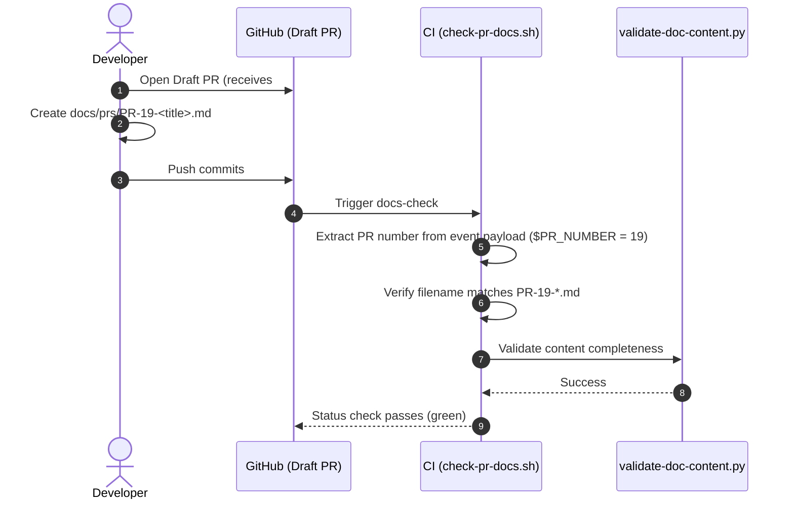

# Technical Specification: Standard PR Document Naming & Number Enforcement

- **PR Link / Ticket:** [PR #19](https://github.com/Advertisement-Market/advertisement/pull/19)
- **Author:** @amjangde
- **Date:** 2026-09-07
- **Module / Path:** `.github/scripts/check-pr-docs.sh`, `docs/prs/`

---

## 1. Overview & Objectives

To maintain a consistent, traceable history connecting GitHub pull requests to version-controlled technical documentation, this specification defines and enforces a standard filename convention for all PR-level documents.

All standalone PR technical documents must reside under `docs/prs/` and prefix their filename with `PR-<number>-`, where `<number>` strictly corresponds to the GitHub PR number.

---

## 2. Technical Architecture & File Layout

PR documents are organized in a dedicated directory:

```text
docs/
├── prs/
│   ├── PR-18-documentation-verification-system.md
│   └── PR-19-pr-naming-convention.md
├── decisions/
├── architecture/
├── templates/
├── GUIDELINES.md
└── README.md
```

### Flow of Number Enforcement in CI



---

## 3. Enforcement Rules in Pipeline

The automated validation in `.github/scripts/check-pr-docs.sh` implements the following rules:

1. **GitHub PR Number Matching:**
   When running within a GitHub Actions pull request event, any newly created file under `docs/prs/` must match `PR-${PR_NUMBER}-<kebab-title>.md`.
2. **Local Pre-Commit & Past PR Docs:**
   Existing or locally tested files under `docs/prs/` must adhere to the standard numeric prefix `PR-[0-9]+-<kebab-title>.md`.
3. **Mismatched Number Rejection:**
   If a PR doc filename uses an incorrect number (e.g. `PR-15-*.md` in PR #19), CI fails immediately with exit code 1 and outputs the expected pattern.

---

## 4. Verification & Testing

The validation script was tested against:
- Matching PR numbers (`PR-19-*.md` on PR #19) -> Passes.
- Mismatched numbers (`PR-18-*.md` newly introduced in PR #19) -> Fails with actionable feedback.
- Content completeness and relative link checks -> Verified with `validate-doc-content.py`.
