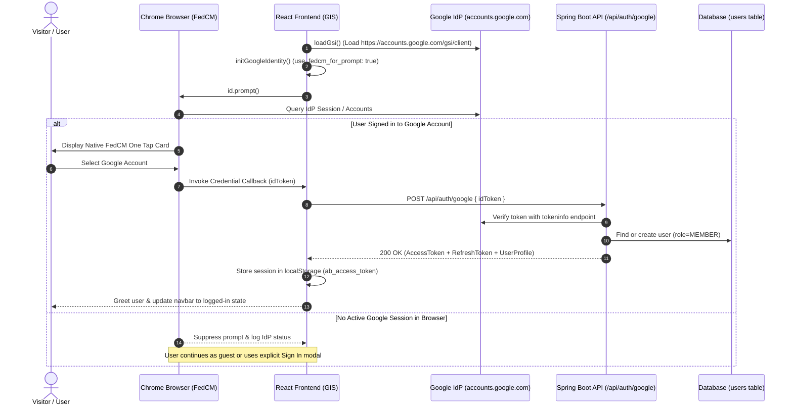

# Frontend Technical Specification: Google Identity Services FedCM Migration & One Tap Fix

- **PR Link / Ticket:** [PR #22](https://github.com/Advertisement-Market/advertisement/pull/22)
- **Author:** @amjangde
- **Date:** 2026-09-07
- **Module / Route:** `frontend/src/features/auth/`

---

## 1. Overview & Problem Statement

Modern Chromium browsers have transitioned authentication prompts to the **Federated Credential Management (FedCM)** browser API to improve privacy and restrict passive third-party cookie tracking.

In the previous implementation:
1. Google Identity Services (GIS) initialization set `use_fedcm_for_prompt: false`, which Google has deprecated and which resulted in browser warnings.
2. The One Tap notification handler in `GoogleOneTap.jsx` called deprecated methods (`notification.isNotDisplayed()` and `notification.isSkippedMoment()`). These methods are no longer supported under FedCM, triggering `[GSI_LOGGER]` warnings in the browser developer console.
3. Unauthenticated browser profiles produced `(index):1 Not signed in with the identity provider` from the browser's FedCM subsystem when no active Google session was detected.

This pull request updates the GIS integration to comply fully with Google's FedCM migration standards, clears deprecation warnings, and ensures stable behavior across supported browsers.

---

## 2. Technical Architecture & Authentication Flow

The diagram below illustrates the updated Google One Tap authentication flow under the FedCM browser API:



---

## 3. Detailed Changes

### 3.1. `frontend/src/features/auth/googleIdentity.js`
- Updated `google.accounts.id.initialize` configuration:
  - Enabled `use_fedcm_for_prompt: true` per Google Identity Services migration specifications.
  - Retained centralized callback management to ensure both `GoogleButton` and `GoogleOneTap` route tokens to the active handler.

### 3.2. `frontend/src/features/auth/GoogleOneTap.jsx`
- Cleaned up the `id.prompt()` invocation by eliminating the deprecated `notification.isNotDisplayed()` and `notification.isSkippedMoment()` callback methods.
- Invokes `id.prompt()` cleanly, allowing the browser and Google Identity Services to manage display moments, cooldowns, and quiet periods natively.

### 3.3. `docs/architecture/frontend_architecture_report.md`
- Updated Section 5.4 with living documentation of `googleIdentity.js`, `GoogleOneTap.jsx`, and `GoogleButton.jsx`, recording FedCM compliance and browser fallback strategies (Safari / ITP).

---

## 4. Cross-Browser Compatibility Analysis

| Browser / Environment | Google One Tap (Auto-Prompt) | Google Sign-In Button | Notes |
| :--- | :--- | :--- | :--- |
| **Google Chrome (Desktop)** | Full Support | Full Support | Powered by FedCM. Requires active Google session in browser profile. |
| **Microsoft Edge (Chromium)** | Full Support | Full Support | Powered by FedCM. |
| **Apple Safari (macOS / iOS)** | Suppressed by ITP | Full Support | Apple's Intelligent Tracking Prevention blocks third-party session discovery. The explicit button opens an OAuth popup window without issue. |
| **Mozilla Firefox** | Standard Support | Full Support | Governed by Firefox Total Cookie Protection rules. |

---

## 5. Verification & Testing Evidence

### 5.1. Automated Verification
All pipeline checks executed and passed locally:

- **Prettier Code Style:**
  ```bash
  npm run format:check
  # Checking formatting... All matched files use Prettier code style!
  ```
- **ESLint Validation:**
  ```bash
  npm run lint
  # 0 errors
  ```
- **Unit Testing (Vitest):**
  ```bash
  npm run test
  # Tests: 5 passed (5)
  ```
- **Vite Production Build:**
  ```bash
  npm run build
  # Built in 164ms cleanly
  ```
- **PR Documentation Compliance:**
  ```bash
  .github/scripts/check-pr-docs.sh
  # ✅ Code/Configuration changes accompanied by verified documentation. Check passed!
  ```

### 5.2. Full-Stack End-to-End Testing
- **Sign-In Flow:** Initialized local backend and frontend (`http://localhost:5173`). Executed Google sign-in.
- **Backend Persistence:** Verified log confirmation:
  ```
  2026-09-07T19:31:57.993+05:30 INFO 71853 --- [theadbasket-backend] [nio-8080-exec-2] c.theadbasket.backend.auth.AuthService : Google sign-in for user id=1 role=MEMBER
  ```
- **Session Lifecycle:** Executed logout followed by re-login; verified existing user was matched by `google_sub` and new JWT session tokens were issued and restored.
