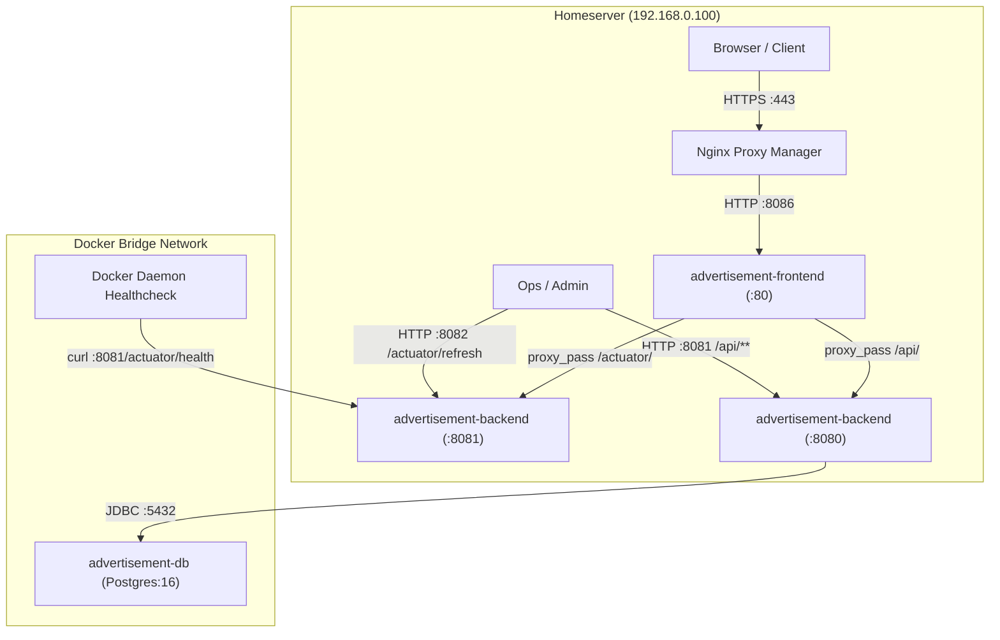

# Infrastructure Technical Specification: Spring Boot Actuator Management Port Alignment

- **PR Link / Ticket:** [PR #23](https://github.com/Advertisement-Market/advertisement/pull/23)
- **Author:** @amjangde
- **Date:** 2026-09-10
- **Module / Route:** `docker-compose.yml`, `backend/Dockerfile`, `frontend/nginx.conf`, `.env.example`

---

## 1. Overview & Problem Statement

In Pull Request #12, Spring Cloud Config and dynamic hot-reloading were introduced alongside a dedicated management port setting in `backend/src/main/resources/application.yml`:

```yaml
management:
  server:
    port: 8081
```

Configuring `management.server.port: 8081` caused Spring Boot to start two distinct HTTP listeners:
1. **Application Server (port `8080`)**: Serving public API endpoints (`/api/**`).
2. **Management Server (port `8081`)**: Serving Actuator endpoints (`/actuator/**`), including `/actuator/health` and `/actuator/refresh`.

However, the container and orchestrator configurations remained mapped to port `8080`:
- **Docker Compose Healthcheck**: Executed `curl -f http://127.0.0.1:8080/actuator/health`, querying port `8080` where Actuator was no longer routed. Spring's `DispatcherServlet` threw `NoResourceFoundException: No static resource actuator/health for request '/actuator/health'`, returning an HTTP 500 error and causing the Docker daemon to continuously mark `advertisement-backend` as `unhealthy`.
- **Frontend Reverse Proxy**: In `frontend/nginx.conf`, the `location /actuator/` directive forwarded traffic to `http://advertisement-backend:8080/actuator/`.
- **Port Inversion**: In `docker-compose.yml`, `ports: ["${BACKEND_PORT:-8081}:8080"]` exposed the backend application port `8080` to host port `8081`, leaving container port `8081` (the actual Actuator server) unexposed.

This PR aligns all infrastructure configurations with the dedicated Actuator management port (`8081`).

---

## 2. Architecture & Networking Topology



---

## 3. Detailed Changes

### 3.1. `docker-compose.yml`
- **Updated Healthcheck**: Changed target health probe from `http://127.0.0.1:8080/actuator/health` to `http://127.0.0.1:8081/actuator/health`.
- **Exposed Management Port**: Added `"${ACTUATOR_PORT:-8082}:8081"` to the backend service ports so management operations (e.g. authenticated `/actuator/refresh`) can be reached from the host.

### 3.2. `backend/Dockerfile`
- Updated container port exposition from `EXPOSE 8080` to `EXPOSE 8080 8081`.

### 3.3. `frontend/nginx.conf`
- Updated reverse proxy configuration for `/actuator/` location from `http://advertisement-backend:8080/actuator/` to `http://advertisement-backend:8081/actuator/`.

### 3.4. `.env.example`
- Added default `ACTUATOR_PORT=8082` documentation under host ports section.

### 3.5. `docs/prs/PR-12-config-driven-hotreload.md`
- Clarified the curl command for configuration hot reload to indicate host port `8082` (mapped to container management port `8081`).

---

## 4. Verification & Testing

1. **Healthcheck Probe Verification**:
   - Tested direct curl to `http://127.0.0.1:8081/actuator/health` inside the container: returns HTTP 200 with `{"groups":["liveness","readiness"],"status":"UP"}`.
2. **API Isolation**:
   - Tested public API port (`8080`): responds correctly with application authentication requirements.
3. **Frontend Actuator Proxy**:
   - Verified Nginx configuration routes Actuator requests directly to backend container port `8081`.
4. **CI Document Compliance**:
   - Executed `.github/scripts/check-pr-docs.sh` to confirm zero template placeholders, valid link integrity, and naming convention compliance.
