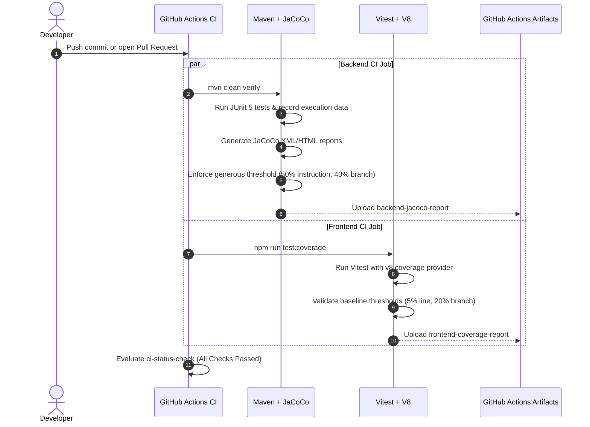

# Technical Specification: Automated Test Coverage Tracking and CI Gating

- **PR Link / Ticket:** [PR #31](https://github.com/Advertisement-Market/advertisement/pull/31)
- **Author:** @amjangde
- **Date:** 2026-09-18
- **Module / Path:** `.github/workflows/ci.yml`, `backend/pom.xml`, `frontend/vite.config.js`, `frontend/package.json`

---

## 1. Overview & Business Requirements

As **The AdBasket** platform grows across frontend (React 19) and backend (Spring Boot 4 / Java 25), automated quality gates are necessary to guarantee regression prevention, code stability, and visible coverage health.

Prior to this update:
1. CI ran tests (`mvn clean verify` and `npm test`) but tracked **0% coverage metrics** and had no baseline threshold enforcement.
2. Backend lacked a bytecode coverage plugin compatible with Java 25.
3. Frontend had Vitest installed with 20 passing unit tests, but lacked coverage providers, artifact publishing, and coverage reporting scripts.

This change implements:
- **Backend JaCoCo (0.8.14)** instrumentation, HTML/XML report generation, and verification check rules with generous minimum thresholds.
- **Frontend Vitest Coverage (v8 engine)** with HTML, JSON, and summary reporters, and lenient baseline thresholds.
- **CI Artifact Uploads** on GitHub Actions to provide downloadable coverage reports on every pipeline run.

---

## 2. Technical Architecture & Component Flow



---

## 3. Configuration & Coverage Threshold Policies

To avoid impeding the development team's velocity, the initial minimum coverage thresholds are intentionally configured with generous safety margins below current measurements.

### Baseline Coverage Comparison

| Metric | Current Actual (Backend) | Configured Threshold (Backend) | Current Actual (Frontend Tested Scope) | Configured Threshold (Frontend) |
| :--- | :--- | :--- | :--- | :--- |
| **Instruction / Statement** | 85.50% | **50%** | 6.56% (overall) / 74%+ (lib) | **5%** |
| **Branch** | 61.57% | **40%** | 44.71% | **20%** |
| **Lines** | 84.85% | N/A | 6.56% | **5%** |
| **Functions** | 72.97% | N/A | 24.13% | **10%** |

### Backend Maven (`backend/pom.xml`)
- Pinned `jacoco.version` to `0.8.14` (ensuring compatibility with Java 25 bytecode major version 69).
- Added `prepare-agent`, `report`, and `check` goals bound to standard build phases.

### Frontend Vitest (`frontend/vite.config.js` & `frontend/package.json`)
- Added `@vitest/coverage-v8` dependency.
- Added `test:coverage` script (`vitest run --coverage`).
- Excluded mock presentations, landing page samples, and static dictionaries from coverage scope (`src/pages/**`, `src/data/**`).

---

## 4. GitHub Actions CI Pipeline Improvements

The Build and Test workflow (`.github/workflows/ci.yml`) was updated:
1. **`frontend-ci`**:
   - Replaced plain `npm test` with `npm run test:coverage`.
   - Added `actions/upload-artifact@v4` step uploading `frontend/coverage/` as `frontend-coverage-report`.
2. **`backend-ci`**:
   - Updated verification step to run `mvn clean verify`, executing both test suites and JaCoCo coverage validation.
   - Added `actions/upload-artifact@v4` step uploading `backend/target/site/jacoco/` as `backend-jacoco-report`.

---

## 5. Verification & Test Evidence

### Local Test Execution
- Backend:
  ```bash
  mvn clean verify
  # [INFO] Analyzed bundle 'backend' with 71 classes
  # [INFO] All coverage checks have been met.
  # [INFO] BUILD SUCCESS
  ```
- Frontend:
  ```bash
  npm run test:coverage
  # % Coverage report from v8: All files: 6.56% Stmts, 44.71% Branch, 24.13% Funcs
  # Test Files 4 passed (4) | Tests 20 passed (20)
  ```
- Code style & Lint:
  ```bash
  npm run format:check
  npm run lint
  ```
