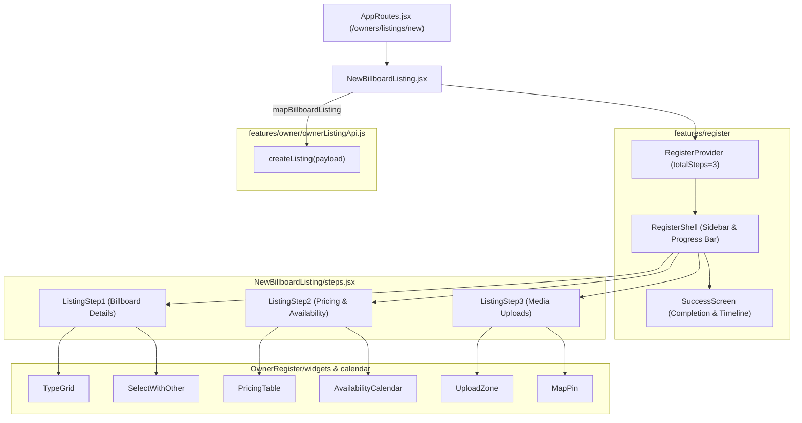

# Frontend Technical Document: Full-Page Multi-Step Billboard Listing Creation Flow

- **PR Link / Ticket:** #32
- **Author:** @vedafactor
- **Date:** 2026-09-18
- **Module / Route:** `frontend/src/pages/NewBillboardListing`, `frontend/src/pages/OwnerDashboard`, `frontend/src/features/owner`

---

## 1. Overview & User Journey

- **User Persona:** Authenticated Billboard Owner (`OWNER` role).
- **User Flow:**
  1. An authenticated owner clicks **"Add New Listing"** from the Topbar or the **"My Listings"** tab in [`OwnerDashboard`](file:///e:/theadbasket/advertisement/frontend/src/pages/OwnerDashboard/OwnerDashboard.jsx).
  2. The application navigates to the dedicated full-page wizard at `/owners/listings/new` ([`NewBillboardListing.jsx`](file:///e:/theadbasket/advertisement/frontend/src/pages/NewBillboardListing/NewBillboardListing.jsx)).
  3. The user completes a structured 3-step creation flow:
     - **Step 1: Billboard Details** (Specs, dimensions, structure type, location, traffic & audience).
     - **Step 2: Pricing & Availability** (Starting price, minimum duration, rate packages, interactive calendar, discount note).
     - **Step 3: Media Uploads** (Guidelines alert, day & night photo upload zones, location pin verification, video tour link).
  4. On final submission, the wizard maps form fields via `mapBillboardListing()` and posts to `ownerListingApi.createListing()` (`POST /api/owner/listings`).
  5. The user sees the [`SuccessScreen`](file:///e:/theadbasket/advertisement/frontend/src/features/register/RegisterShell.jsx) with a verification timeline and clicks **"Back to My Listings"** to return to [`/owners/dashboard`](file:///e:/theadbasket/advertisement/frontend/src/pages/OwnerDashboard/OwnerDashboard.jsx) where the new listing is loaded directly from the backend.
- **Key UX Objectives:**
  - Replaces the previous minimal modal with a comprehensive, full-screen onboarding experience that preserves the exact layout, step progress indicator, and validation standards established in the Owner Registration wizard.
  - Maintains fast in-dashboard edit modal (`isEdit=true`) and delete modal for existing listings.

---

## 2. Component Hierarchy & Architecture



### Component Breakdown
* **`NewBillboardListing.jsx`**: Controller component wrapping `RegisterProvider` and `RegisterShell`, defining step metadata, validation, and submission handler.
* **`steps.jsx`**: Step panels for Billboard Details, Pricing/Calendar, and Media Uploads.
* **`NewBillboardListing.css`**: Scoped styling importing OwnerRegister theme tokens and typography.

---

## 3. State Management & Data Flow

* **Global Contexts Consumed:** `AuthContext` (checks user authentication), `ToastContext` (validation feedback).
* **Form & Step State:** Managed via `RegisterProvider` / `useRegister()` hook (`field`, `setField`, `goToStep`, `currentStep`, `submitted`).
* **Field Mapping & Strict Scope (`mapBillboardListing`):**
  - `mapBillboardListing(data)` in [`registrationMappers.js`](file:///e:/theadbasket/advertisement/frontend/src/features/auth/registrationMappers.js) produces an explicit object aligned with backend `BillboardListingCreateRequest` (`name`, `addressLine1`, `addressLine2`, `landmark`, `city`, `state`, `pincode`, `type`, `typeOther`, `widthFt`, `heightFt`, `groundHeightFt`, `facing`, `trafficType`, `trafficTypeOther`, `audienceType`, `audienceTypeOther`, `footfall`, `startPrice`, `minBookingValue`, `minBookingUnit`, `discountNote`).
  - Minimum booking duration is split into `minBookingValue` (Integer) and `minBookingUnit` (Enum: `DAYS`, `WEEKS`, `MONTHS`) via `parseMinBooking()`.
  - When `"Other"` is selected for type, traffic, or audience, the canonical enum code `OTHER` is sent alongside its custom text description (`typeOther`, `trafficTypeOther`, `audienceTypeOther`).
  - Client-side visual simulations (interactive calendar range picker `f_calBookedDates`, photo blobs `f_photos`, video tour URL `f_videoUrl`) are **strictly excluded** from the payload sent over the wire.
* **Proactive UI Notices:**
  - **Step 2 (Calendar):** Includes an explicit inline note: *(Note: Cloud calendar sync will be enabled in Phase 3; your rate card parameters are saved directly to your inventory.)*
  - **Step 3 (Media):** Includes an explicit note in the reference guidelines: *(Note: Media file storage will be linked in Phase 3; your listing specifications and rates are saved directly to your live database inventory.)*


---

## 4. API Integration & Network Handling

* **API Endpoints Consumed:** `POST /api/owner/listings` via `ownerListingApi.createListing(payload)`
* **Response Status:** `201 Created` with created `BillboardListingDto`
* **Event-Driven In-App Notification:** Upon successful listing creation, backend `OwnerListingService.createListing()` dispatches an in-app notification via `NotificationService.createNotification()`:
  - **Category:** `NotificationCategory.ONBOARDING`
  - **Tone:** `NotificationTone.TEAL`
  - **Title:** `"New Billboard Listed"`
  - **Message:** `"Your listing \"{name}\" has been created and submitted for verification."`
  - **Target URL:** `"/owners/dashboard?tab=listings"`
* **Error Handling:** Centralized `apiErrorMessage(err)` utility surfaces server validation error messages in toast notifications.

---

## 5. Verification & Testing Evidence

### Backend Automated Test Suites
* **`OwnerListingServiceTest`:** Verified `createListing` validates LOV enums, calculates `minBookingDays`, persists entity, and dispatches the in-app notification to `NotificationService`.
* **`OwnerListingControllerTest`:** Verified `POST /api/owner/listings` creates listing with duration split and persists notification record in H2 database with category `ONBOARDING` and tone `TEAL`.
* **Full Backend Suite:**
  ```bash
  mvn test
  ```
  Output: `Tests run: 126, Failures: 0, Errors: 0, Skipped: 0` (BUILD SUCCESS).

### Frontend Automated Test Suites
* **Mapper & Client Unit Tests:**
  ```bash
  npm test
  ```
  Output: `5 test files passed (28 tests passed)` across `registrationMappers.test.js`, `ownerListingApi.test.js`, `notificationApi.test.js`, `validators.test.js`, and `pincodeAutofill.test.js`.
* **Linting & Code Formatting:**
  ```bash
  npm run lint
  ```
  Passed with zero errors.
* **Vite Production Build:**
  ```bash
  npm run build
  ```
  Built successfully in 418ms.
